## Overview

This chapter focuses on understanding the physical structure of a UAV from a systems perspective. The purpose is not to study aerodynamics in depth, but to understand how the aircraft is physically arranged, how its main structural parts are organized, and how control surfaces are integrated into the structure.
The airframe is the skeleton and skin of the UAV. It is the part that gives shape to the vehicle and physically holds all other subsystems together.
When we say “airframe,” we mean the fuselage, wings, tail surfaces, and all fixed structural components. The airframe does not include avionics, propulsion electronics, or batteries; however, it must physically host and support them.
In a target drone or expendable UAV, the airframe is usually simple and function-driven. The goal is not long endurance or maximum aerodynamic efficiency. The goal is to provide a stable and controllable flying platform that can execute the mission profile.
---

## 1. Fuselage

The fuselage is the central body of the UAV. It connects the wings and tail into one continuous structure. It provides the volume and attachment points required to integrate avionics, power systems, payload, propulsion interfaces, and wiring harnesses.

The fuselage also transfers aerodynamic, inertial, and landing or launch loads between the wings, tail, and propulsion unit.

The fuselage carries primary bending loads from the wings and houses all critical subsystems.

The fuselage typically contains:

- The avionics bay, where the flight controller and other electronics are installed.
- The wiring harness that connects sensors, servos, and power lines.
- The propulsion mounting area (if the engine or motor is rear-mounted or nose-mounted).
- Structural attachment points for the wings.

### 1.1 Key Interfaces of Fuselage

#### 1. Mechanical Interfaces

- Wing mount (bolts, spars, inserts into fuselage box).
- Tail boom or tail mount.
- Motor mount (front or rear).
- Servo mounting rails.

#### 2. Electrical Interfaces

- Routing channels for all wiring (servos, ESC, battery, telemetry).

#### 3. Avionics Interfaces

  - Rigid mounting base for IMU (low-vibration zone).
  - GPS placement (should be located away from high-current cables and noise sources)

#### 4. Thermal Interfaces

- Vent holes for ESC and battery cooling.

---

The fuselage layout is driven less by aerodynamic optimization and more by functional packaging and subsystem interfaces. In addition, the fuselage defines the center of gravity (CG) location.

The avionics bay must be located close to the vehicle’s center of gravity to minimize sensitivity to mass variation while providing sufficient space for the flight controller, IMU isolation, power distribution, and cooling airflow.
The propulsion mounting region must be structurally reinforced to handle thrust, torque, and vibration loads, which are then transferred through the fuselage structure.

#### What is Mass Variation?

Mass variation refers to any change in the distribution or magnitude of mass in the UAV during its life cycle that can shift the center of gravity (CG) or alter inertial properties.
Mass variation typically results from:

- Fuel burn in gasoline-powered systems.
- Payload installation or removal.

From a dynamics standpoint, the aircraft does not respond only to total mass. It responds to where that mass is located relative to the CG. When a component is far from the CG, even a small mass change produces a larger pitching or yawing moment. When a component is near the CG, the same mass change produces almost no moment.
For this reason, system engineers try to place mass-variable components as close to the CG as possible. This improves robustness across builds and mission configurations.

---
## 2. Wings
The wing is the primary lift-generating surface of the UAV. It is attached to the fuselage and extends laterally on both sides.
Several geometric terms must be clearly understood:

- Span: the total distance from one wing tip to the other.
- Chord: the distance from the leading edge to the trailing edge.
- Wing root: the part of the wing that connects to the fuselage.
- Wing tip: the outermost end of the wing.

### Wing Geometry

The wing is the primary lift-generating surface of the UAV.

Several geometric terms must be clearly understood:

- **Span** – the total distance from one wing tip to the other.
- **Chord** – the distance from the leading edge to the trailing edge.
- **Wing root** – the part of the wing that connects to the fuselage.
- **Wing tip** – the outermost end of the wing.

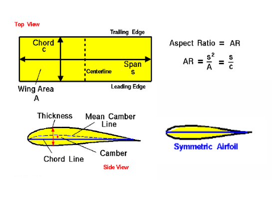

*Figure 2.1 — Geometric terms of wings*

These terms are fundamental because they are used in discussions about performance, stability, and control authority. 

## 2.1. Wing Layout

The wing layout determines how lift forces enter the airframe and how those forces are transmitted into the fuselage. Regardless of aerodynamic performance, the wing must provide a structurally efficient load path from distributed lift forces into a limited number of attachment points at the fuselage.
These attachment points must interface mechanically with fuselage frames or bulkheads that are designed to carry bending and torsional loads without excessive deformation.

### 2.1.1 High-Wing Layout

In a high-wing layout, the wing is mounted above the fuselage. Lift forces are transferred downward into the fuselage through relatively short load paths. This often improves lateral stability and simplifies internal packaging.

High-wing layouts are frequently used in surveillance or target drones because they allow unobstructed fuselage volume.

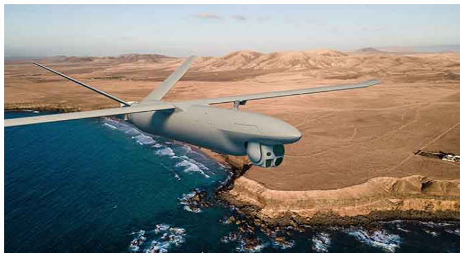

*Figure 2.2 — High-wing layout*

#### 2.1.2 Mid-Wing Layout

In a mid-wing layout, the wing is mounted near the vertical center of the fuselage. Lift forces enter near the fuselage centroid, which can reduce bending moments in the fuselage structure.

However, this configuration complicates internal layout because the wing spar passes directly through the avionics or payload volume, creating integration constraints that must be addressed early in the system architecture.

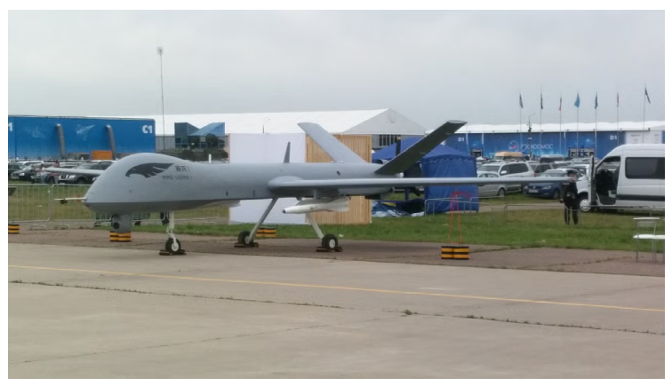

*Figure 2.3 — Mid-wing layout*

#### 2.1.3 Low-Wing Layout

In a low-wing layout, the wing is mounted below the fuselage. Lift forces must be transferred upward into the fuselage structure, often requiring stronger wing-fuselage joints.

Low-wing layouts are less common in expendable UAVs unless driven by propulsion integration or launch system constraints.

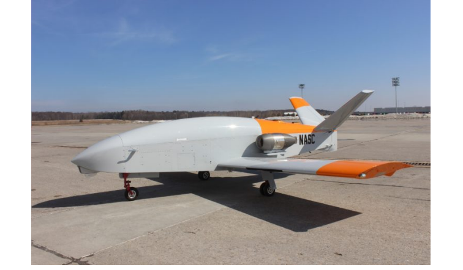

*Figure 2.4 — Low-wing layout*

### 2.2 Wing Types

#### 2.2.1 Straight Wing

##### Pysical Characteristics

- High lift at low speeds.
- Simple manufacturing (foam, composites, plywood ribs).
- Predictable stall behavior.
- Used in most expendable UAVs.

##### Interfaces

- Ailerons or elevons are typically cut into the trailing edge.
- Servos are embedded inside the wing, with wiring routed through the wing root into the fuselage.
- Wing spars must align structurally with the fuselage mounting box.

#### 2.2.2 Swept Wing

##### Pysical Characteristics

- Reduces drag at higher speeds.
- Delays tip stall by lowering effective angle of attack.
- More complex aerodynamics.
- Structurally more complex due to asymmetric load paths.

##### Interfaces

- Requires angled mounting hardpoints.
- Servo installation geometry becomes more complex.
- Wiring exits the wing root at an angle, complicating harness routing.

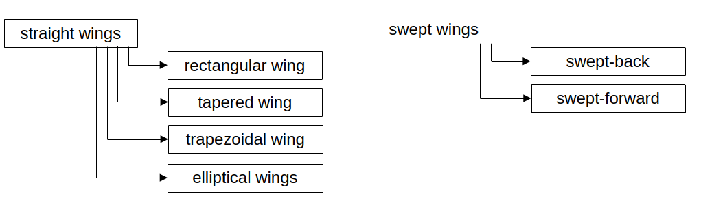

*Figure 2.5 — Classification of straight and swept wing planforms*

#### 2.2.3 Simple Rectangular Wing

Simple rectangular wing is a simplified form of the straight wing.

##### Pysical Characteristics

- Easiest to manufacture.
- Constant chord simplifies control surface sizing.
- Suitable for low-cost or single-use UAVs.
- Predictable roll stability.

##### Interfaces

- Identical servo pockets on left and right.
- Straight hinge lines.
- Flat wing-fuselage joint.

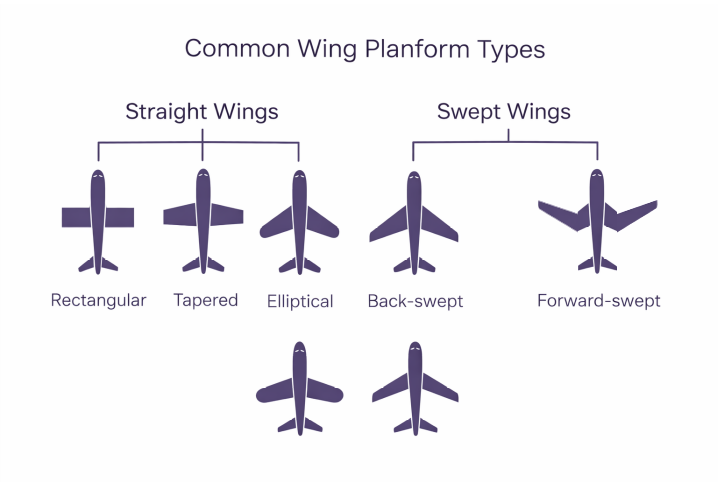

*Figure 2.6 — Types of wings*

### 2.3 Control Surfaces

#### Aileron (Roll Control)

Ailerons are located on the outer trailing edge of the wings.

When the left aileron deflects downward and the right aileron deflects upward, lift increases on the left wing and decreases on the right wing, causing the aircraft to roll toward the right.

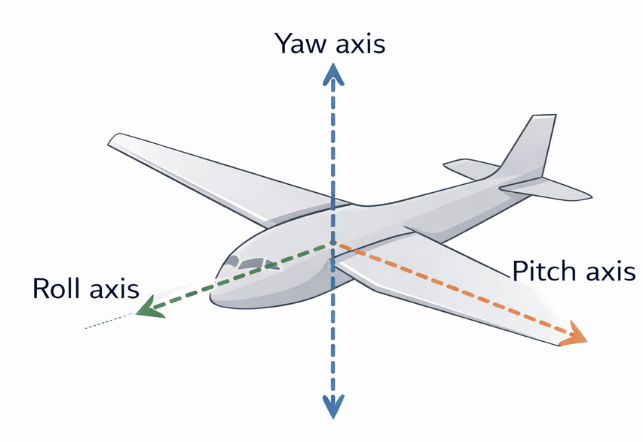

*Figure 2.7 — Rotational Axis*

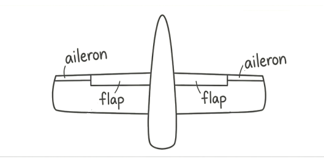
gftg

#### Elevator (Pitch Control)

Elevators control the nose up and nose down pitching motion.

When the elevator is deflected downward, the lift on the tail is increased, pulling the tail up and the nose down.

Elevator up → tail pushes down → nose pitches up

Elevator down → tail pushes up → nose pitches down

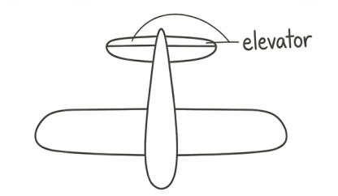

*Figure 2.9 — Elevator*

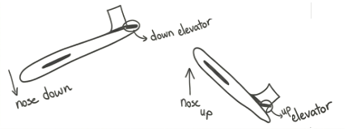

*Figure 2.10 — Effect of Elevator Deflection on Aircraft Pitch*

#### Rudder (Yaw Control)

Rudder controls the nose of the airplane to the right or left and is mounted on the vertical stabilizer. Deflected rudder creates a side force on the tail.

Rudder right → nose yaws right

Rudder left → nose yaws left.

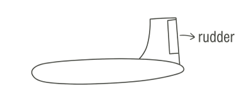

*Figure 2.11 — Rudder*

#### Spoilers (Lift Dumping Devices)

Spoilers are panels on the top surface of the wing. When a spoiler is raised, it disrupts airflow over the wing and destroys lift.

It helps with roll control. When the spoiler up on the right wing, lift decreases on right wing and the airplane rolls right. It works similarly to ailerons but uses lift destruction instead of differential lift. Spoilers produce drag and helps slow the aircraft.

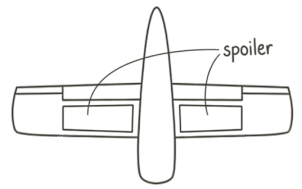

*Figure 2.12 — Spoilers*

#### Flaps and Slats

Flaps and slats are high-lift devices used primarily in larger aircraft.

They increase lift at low speeds, enabling shorter take-offs.

They increase drag, which helps the plane slow down for landing (enabling shorter landings)

Flaps are located on the trailing edge of the wing and increase both lift and drag.

Slats are on the leading edge and primarily prevent stalls by smoothing airflow at high angles of attack.

Both extend and pivot downwards to change the wing’s shape and increase its surface area.

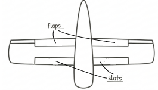

*Figure 2.13 — Flaps and Slats*

Flaps change the wing’s shape to a higher camber, boosting lift. 

During take-off and landing both flaps and slats are deployed. This combination allows the aircraft to generate high lift at slow speeds. For landing, high drag from the flaps is also beneficial for slowing the aircraft down.

#### Flying Wing

A flying wing is an aircraft where the entire aircraft is just a wing. All lift stability and control come from the wing itself and from control surfaces mounted on it (typically elevons). Because the flying wing has no tail, it must achieve pitch stability, yaw stability and roll authority using only wing shape and elevons.

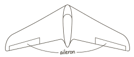

*Figure 2.14 — Elevons on a Flying Wing*

Elevons combine elevator and aileron functions:

- Both up → nose pitches down
- Both down → nose pitches up
- Opposite deflection → roll(left up, right down → left turn and vice versa)

---

## 3. Structural Components

### 3.1. Wing Structure: Spars, Ribs, and Skin

Inside a wing, the strongest structural element is the spar, which runs spanwise from the wing root toward the wingtip. The spar behaves like a beam, resisting bending loads generated by lift. As the wing produces lift, the upper surface of the wing experiences compression and the lower surface experiences tension; the spar connects these surfaces and allows the wing to survive the upward bending moment.

A single spar may be sufficient for lightweight UAVs, but more robust designs use two spars (front and rear) to resist both bending and torsion. When the wing bends upward under lift, the spar absorbs most of this load, transferring it into the fuselage at the wing root, which is why this region must be particularly strong.

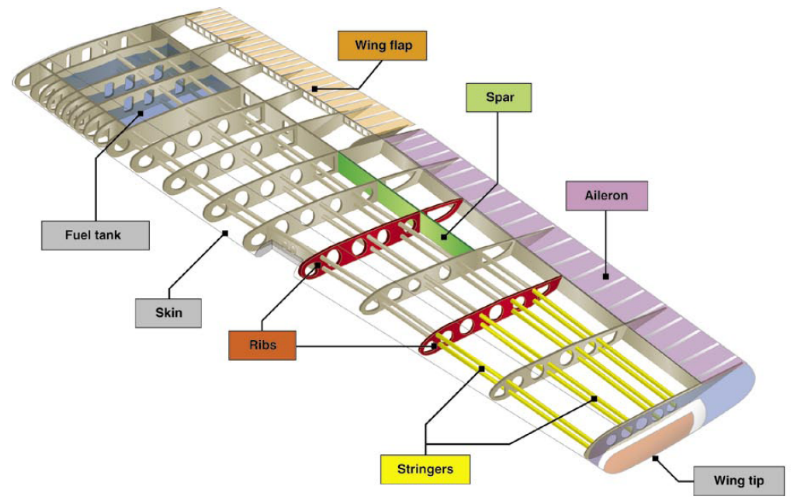

*Figure 2.15 — Structural Components of a Wing*

While the spar carries the majority of bending forces, the ribs give the wing its aerodynamic shape. Ribs run chordwise from the leading edge to the trailing edge, and they maintain the airfoil profile over the entire span. Ribs also help distribute loads into the spar and prevent the thin upper and lower skin from collapsing or deforming under aerodynamic pressure.

In essence, the spar is the wing’s backbone, and the ribs are the bones that keep the shape correct for flight.

The outer surface of the wing, known as the skin, works together with the spar to create a stiff box structure. The skin carries shear loads and provides the smooth aerodynamic surface necessary for lift. When top and bottom skins are bonded to the spar and ribs, the entire assembly behaves like a closed torque box, which significantly increases torsional stiffness.

This torsional stiffness is critically important for control authority: if the wing twists under aileron or elevon input, the surface may deflect but the wing twist may counteract the intended roll, reducing control effectiveness or even causing aeroelastic issues. This is why even expendable UAVs must maintain a minimum level of torsional rigidity.

### 3.2 Fuselage Structure: Bulkheads, Longerons, Stringers, and Frames

The fuselage, although often a simple tube or box on small UAVs, is still a structural component that distributes loads between the wings, tail, and internal components.

Inside the fuselage, bulkheads act like vertical walls that shape the cross-section and provide mounting points for major loads. For example, a bulkhead near the wing root transfers wing bending loads into the fuselage. Another bulkhead may support the motor mount, absorbing thrust loads from the propulsion system. Bulkheads also prevent the fuselage from collapsing or deforming, especially in composite or foam constructions where the outer shell alone is not sufficient to carry all loads.

Running lengthwise along the fuselage are longerons, which are structural members that connect bulkheads and carry longitudinal tension and compression forces. When the aircraft pitches or experiences aerodynamic loads at the tail, these loads travel through the tail boom or fuselage and into the main body; longerons help resist the resulting bending moments.

Smaller strips called stringers reinforce the fuselage skin between bulkheads and provide stiffness against buckling.

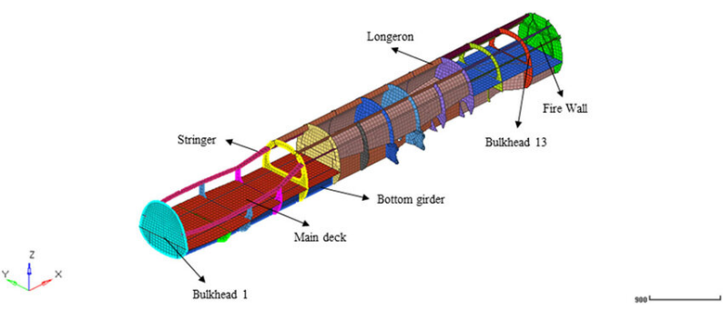

*Figure 2.16 — Structural Components of Fuselage*

### 3.3 Tail Boom as a Structural Beam

In UAVs that use a tail boom instead of a full fuselage extending to the tail, the boom itself becomes a slender, lightweight cantilever beam.

The boom must resist:

- Bending due to elevator actions.
- Torsion due to rudder actions.
- Vibration due to motor or aerodynamic disturbances.

When the elevator deflects upward, the tail produces a downward force; this force creates a bending moment at the base of the boom. Similarly, rudder deflection causes yawing forces that twist the boom.

For this reason, tail booms are often made from carbon fiber tubes, which offer excellent stiffness-to-weight ratios.

### 3.4 Load Paths: How Forces Travel Through the Structure

Every structural component exists to create a clear and safe load path, which is the route forces take as they move through the aircraft.

For example, lift acts upward on the wing surface; this load flows through the skin to the ribs, then into the spar, and finally into the fuselage at the wing root. From the fuselage, forces travel through bulkheads and longerons and eventually to the tail or landing gear as needed.

Understanding these load paths is essential for systems engineering because it helps identify where interfaces must be strong, where vibrations may concentrate, and where subsystem mounting must be carefully planned.

### 3.5 Mounting and Hardpoints

Mounting hardpoints are the intentional load-transfer locations in an airframe where components are attached and forces are introduced into the structure. A hardpoint is not simply a hole, bracket, or screw location; it is a designed structural interface that defines where, how, and through what path loads enter the airframe.

In a UAV, every meaningful subsystem—wings, tail surfaces, servos, propulsion units, landing or launch interfaces, batteries, and avionics trays—connects to the airframe through hardpoints. From a systems engineering perspective, hardpoints are the physical embodiment of subsystem interfaces.

Airframe structures such as skins, foam cores, or thin composite shells are usually not designed to carry concentrated loads. If you attach a component directly to a thin skin, the local stresses become very high, leading to cracking, delamination, or permanent deformation.

Hardpoints exist to:

- Spread concentrated loads over a larger structural area.
- Introduce forces into load-bearing members (frames, spars, ribs).
- Ensure repeatable and predictable load paths.
- Protect lightweight structure from localized failure.

#### Typical Hardpoints in an Expendable UAV

There are a few hardpoints that appear in almost every expendable UAV design:

- Wing–fuselage attachment hardpoints, which transfer lift, drag, and torsional loads from the wing into fuselage frames or spars.
- Servo mounting hardpoints, which must react hinge moments and actuator torque without local flexing.
- Propulsion hardpoints, which carry thrust, torque, and vibration loads into the fuselage.
- Avionics tray or equipment shelf hardpoints, which carry inertial loads and protect sensitive electronics.
- Launch or recovery hardpoints, such as catapult hooks, rails, or skid mounts.

Each of these introduces different types of loads (axial, shear, bending, torsion) and therefore requires different structural treatment.

#### Hardpoints and Load Paths (Critical Concept)

A hardpoint is only meaningful if it connects to a continuous load path.

For example, a servo hardpoint must:

- Transfer torque into a mounting plate.
- From the plate into a rib or bulkhead.
- From the bulkhead into the main structure.
  
If any part of this chain is weak or flexible, the hardpoint technically exists but functionally fails.

This is why engineers often say:
“A hardpoint is not a point. It is a region.”
The region includes reinforcements, doublers, inserts, and surrounding structure.

#### Servo Hardpoints

Servo hardpoints deserve special attention because they experience reversing, dynamic loads.

A servo hardpoint must:

- Resist torque without twisting.
- Maintain alignment with the hinge axis.
- Avoid creep or loosening over time.
- Survive vibration and shock.
- 
Common design solutions include:

- Locally thickened skins.
- Plywood, aluminum, or carbon inserts.
- Bonded mounting frames tied into ribs or spars.

#### Wing and Tail Hardpoints

Wing hardpoints are among the most heavily loaded interfaces in the airframe.
 They must carry:

- Bending loads from lift.
- Shear loads from drag.
- Torsional loads from rolling moments and control surfaces.
  
These loads are usually transferred through:

- Spars.
- Carry-through structures.
- Reinforced fuselage frames.

Tail hardpoints are similar but scaled down. Despite lower absolute loads, tail hardpoints are critical because loss of tail integrity almost always means loss of the vehicle.

### 3.6 Control Surface Mounting

Control surfaces such as ailerons, elevators, rudders, and elevons must be mounted in a way that allows them to rotate freely about a hinge line while still transmitting aerodynamic forces safely into the wing or tail structure. Although they may look like simple flaps on the trailing edge, they are actually part of a carefully designed mechanical system that combines hinges, horns, pushrods, servo mounts, and internal structural reinforcement.

Once the surface can rotate, the next step is to mount the servo in a position that allows efficient force transmission. Servos are typically installed inside the wing or fuselage on rigid mounting blocks. These mounting blocks must be structurally stiff, because any flex between the servo body and the aircraft structure becomes lost motion, making the control surface less responsive. When the servo rotates, it moves a small output arm. A pushrod connects this arm to a horn mounted on the control surface itself. The horn is a short lever that converts the push-pull motion of the rod into rotational movement of the surface. The geometry of horn placement—its distance from the hinge line—directly determines how much surface deflection occurs for a given servo rotation and how much aerodynamic load is transmitted back to the servo.

During flight, aerodynamic forces on the control surfaces can be surprisingly large, even on small expendable UAVs. When an aileron deflects upward, the air pressure on the bottom surface pushes it back toward neutral; similarly, downward deflection increases lift and creates a restoring moment. These forces attempt to rotate the horn and push the rod backward, meaning the servo must resist these loads continuously. For this reason, both the servo mount and the pushrod system must be rigid. If the servo mount flexes or the pushrod bends under aerodynamic load, the surface no longer reaches the commanded position, causing reduced control authority and degraded stability.

Because control surfaces generate roll, pitch, or yaw moments by modifying the airflow around the trailing edge, the connection between the control surface and the main structure must be fully rigid. The ribs or spars near the hinge line often include additional reinforcement to absorb the concentrated loads coming from hinge brackets. Without this reinforcement, the hinge points could tear out or deform the surface, leading to flutter or complete structural failure.

It is important to note that all control surface systems must be integrated with the flight controller not only mechanically but also electronically. The servo output range, neutral trim, and maximum deflection angles must match the mechanical geometry. If the horn is mounted too far from the hinge or at the wrong angle, the surface may hit its mechanical stop before the servo reaches its commanded travel. This results in nonlinear response, poor control feel, or even servo burnout.

In summary, control surface mounting and actuation is a tightly coupled system involving structural stiffness, hinge geometry, servo placement, and aerodynamic loading. Even in low-cost expendable UAVs, this system must be designed with precision, because poor mounting or insufficient stiffness leads directly to reduced control authority, unpredictable flight characteristics, and—in the worst case—loss of the vehicle.

### 3.7 Servo Actuators

Servo actuators are the final execution element of the flight control chain. While the flight controller decides what the aircraft should do, servos are the components that physically apply torque and motion to the control surfaces. From a systems point of view, servos sit at the intersection of electrical power, control signals, mechanical loads, and structural integrity.

A typical UAV servo converts an electrical command signal into a controlled angular displacement using an internal motor, gear train, position sensor, and control electronics. This means that even the simplest servo is already a closed-loop system, and its behavior directly affects flight stability and control fidelity.

#### What is a closed-loop system?

A closed-loop system is a system that measures its own output and uses that information to correct itself.

In the case of a servo:

- you command a target angle (for example, 15°),
- the servo moves,
- an internal sensor (usually a potentiometer or encoder) measures the actual angle,
- the internal controller compares commanded angle vs actual angle,
- the motor keeps adjusting until the error is minimized.
  
This feedback loop is why servos stop at the correct position instead of spinning freely.

If there were no feedback, the servo would be open-loop, meaning it would apply power without knowing whether it reached the desired position. That would be unusable for control surfaces.

From a structural standpoint, servos are load-bearing components, not just electronics. The aerodynamic forces acting on a control surface generate hinge moments, and those hinge moments are transmitted directly into the servo output shaft, gears, casing, and finally into the airframe through the servo mount. If the surrounding structure is flexible, part of the commanded motion is lost in deformation, reducing effective control authority.

Because of this, servo placement is primarily driven by load paths, not convenience. Servos are typically mounted close to the control surface they drive in order to minimize linkage length,backlash, and elastic deformation. Long pushrods or cables increase compliance and introduce phase lag, which is particularly problematic for pitch control.

Servo torque rating is one of the most important parameters at system level. The servo must be capable of producing sufficient torque to overcome maximum expected aerodynamic hinge moments with margin, while also accounting for friction, wear, and voltage drop. Undersized servos do not fail gracefully; they saturate, overheat, or stall, leading to loss of control rather than degraded performance.

Finally, from a manufacturing and integration viewpoint, servos are major assembly drivers. They require precise cutouts, alignment with hinge axes, strain-relieved wiring, and repeatable mounting geometry. Poor servo installation is one of the most common root causes of control issues in early prototypes.

--- 

## 4. Manufacturing Considerations

Manufacturing considerations shape the airframe as much as aerodynamics or structural theory, especially in expendable UAVs. A design that is structurally sound but difficult to manufacture, assemble, or reproduce consistently is a system-level failure, even if it flies well once.

At this level, manufacturing is not about factory details; it is about designing geometry, interfaces, and tolerances that survive reality.

Manufacturing drives structure (not the other way around)

In theory, structures are optimized for load paths and stiffness. In practice, they are constrained by:

- available materials,
- achievable tolerances,
- repeatable assembly steps,
- skill level of technicians,
- inspection and rework capability.
- 
This is why many UAV airframes appear structurally conservative in certain regions. Designers intentionally avoid shapes, joints, or thickness transitions that are difficult to fabricate reliably, even if a lighter theoretical solution exists.

In expendable UAVs, repeatability is more valuable than optimality.

### 4.1 Material Choice as a Manufacturing Decision

Material selection is often driven less by strength and more by process compatibility.

For example:

- foam-core composite wings are popular because they allow fast shaping, bonding, and local reinforcement with inserts,
- plywood and aluminum are frequently used at hardpoints because they tolerate drilling and fasteners well,
- full carbon solutions may be avoided not due to strength, but due to inspection difficulty and cost sensitivity.
  
Thus, materials are selected to fail predictably, not just to be strong.

### 4.2 Manufacturing and Hardpoints

Hardpoints are the manufacturing stress concentrators of an airframe.

They are the locations where:

- drilling accuracy matters,
- insert placement must be correct,
- bonding quality is critical,
- errors are hardest to fix after cure.
- 
For this reason, hardpoints are often:

- oversized locally,
- geometrically simple,
- reinforced symmetrically,
- tolerant to small misalignments.
  
This explains why hardpoints often look “overbuilt” compared to surrounding structure. That extra margin absorbs manufacturing variation, not flight loads alone.

### 4.3 Tolerances and "fit-for-purpose" Accuracy

In UAVs, not all dimensions deserve the same precision.
Manufacturing-aware design accepts that:

- aerodynamic surfaces tolerate small geometric variation,
- structural interfaces tolerate very little,
- hardpoints and alignment axes are critical,
- cosmetic accuracy is irrelevant.
- 
This leads to tolerance hierarchy:

- tight tolerances only where load paths or alignment require them,
- loose tolerances elsewhere to reduce cost and scrap.
  
Good designers do not ask manufacturing to “be precise everywhere”.

### 4.4 Design for Inspection and Repair

Even expendable systems must be inspectable, at least during production.

Manufacturing-aware airframes:

- expose hardpoints visually,
- allow bond lines to be checked,
- make cracks or delamination detectable,
- allow replacement of servos or actuators without destruction.
  
If a failure cannot be seen or isolated, it will escape into flight.

---

## 5. Structural Failure Modes in UAV Airframes

This chapter explains how structural parts of a UAV can fail, why those failures occur, and how they affect the system as a whole. The purpose is to understand risk from a systems engineering perspective.

A structural failure is different from an electrical or software failure. Electrical and software failures can often be detected, corrected, or mitigated during flight. Structural failures are usually mechanical, physical, and irreversible. Once a structural element breaks, the aircraft may lose control immediately. For this reason, structural failures are often catastrophic rather than degradable.

A systems engineer must understand:

- Which structural failures are most critical.
- Which failures happen suddenly and which develop slowly.
- Which areas of the airframe carry the highest risk.
- Which failures can be detected before flight.
- Which failures provide no warning.

Understanding failure modes allows better architecture decisions, better inspection planning, and better requirement writing.

The airframe carries aerodynamic loads, inertial loads, propulsion loads, and control surface loads. These loads are transferred through specific load paths. If a load path is interrupted because of a crack, fracture, or delamination, forces no longer flow safely through the structure.

Unlike avionics, structure has no “reset” function. If a wing root fails, the aircraft does not degrade gracefully. It usually experiences an immediate loss of stability and control.

From a systems engineering perspective, structural failure is often a single-point catastrophic risk. There is usually no redundancy in the primary airframe structure of an expendable UAV.

Therefore, the airframe must not only be strong. It must be predictable under load.

### 5.1 Wing Root Failure

The wing root is one of the most highly stressed regions in the entire airframe. Lift is generated along the entire span of the wing. This lift creates an upward distributed load. The spar carries this load toward the fuselage. At the wing root, all bending loads accumulate and are transferred into the fuselage structure.

At this location:

- Bending moment is maximum.
- Shear force is high.
- Torsional load from control inputs may also be present.
- 
This combination makes the wing root a structural hotspot.

These failures may occur because of:

- Underestimated load cases.
- Manufacturing defects.
- Fatigue.
- Shock loading during launch.
- Poor load distribution at the hardpoint.

#### Typical Failure Mechanisms

Wing root failure can occur in several ways:
- The spar may fracture due to excessive bending.
- The bonding between spar and skin may fail.
- A composite laminate may delaminate.
- Bolt holes may elongate or crack.
- Inserts may pull out from foam cores.
- 
Wing root failure is almost always catastrophic.

### 5.2 Hinge Line and Control Surface Tear-Out

Control surfaces are attached through hinges. These hinges transmit aerodynamic loads into the wing or tail structure.
Although control surfaces appear small, they experience significant hinge moments. When a control surface deflects, air pressure creates a restoring force that tries to push it back toward neutral.

#### Failure mechanisms

Control surface failure may occur if:

- The hinge bracket is attached only to thin skin.
- Reinforcement near the hinge line is insufficient.
- Servo torque exceeds structural capacity.
- Flutter develops due to flexibility.
- 
Possible failure modes include:

- Hinge bracket pull-out.
- Local cracking of skin.
- Crushing of ribs near hinge locations.
- Progressive enlargement of screw holes.

#### If a control surface tears out:

- That axis of control is lost.
- The aircraft may enter uncontrollable motion.
- Flutter may increase rapidly.
- The vehicle may fail within seconds.
Control surface failures are often rapid and provide little warning.

### 5.3 Servo Mount Structural Failure

A servo is not only an electronic device. It is a load-bearing mechanical component. Aerodynamic hinge moments are transmitted into the servo output shaft, internal gears, casing, and finally into the airframe through the mount.

#### Failure mechanisms

Servo mount failure may occur if:

- The mounting base is flexible.
- The insert is too small.
- Screws loosen under vibration.
- The surrounding structure creeps over time.
- The servo is oversized relative to the mounting strength.
- 
Unlike wing root failure, servo mount failure is often progressive.

Servo mount degradation reduces control authority gradually. The autopilot may attempt to compensate by increasing control output. This increases servo load further.

If the mount fails completely, control of that surface is lost.

This failure may not be immediately catastrophic, but it significantly reduces flight stability.

### 5.4 Hardpoints Delamination or Insert Failure

Hardpoints are intentional load-transfer regions. They are often reinforced with inserts or thicker laminates. Because loads concentrate at hardpoints, these regions are vulnerable to stress concentration.

#### Failure mechanisms

Common hardpoint failures include:

- Insert pull-out from foam cores.
- Delamination around bonded plates.
- Crushing of core material.
- Cracking near bolt holes.
- Fatigue at repeated attachment interfaces.
  
Manufacturing quality strongly influences hardpoint reliability.

If a hardpoint fails:

- A wing attachment may loosen.
- A propulsion mount may misalign.
- A servo rail may shift.
- An avionics tray may detach under inertial load.
Hardpoint failure can be either progressive or sudden depending on the load type.

### 5.5 Tail Boom Buckling or Fracture

In many UAV configurations, the tail is supported by a slender boom rather than a full fuselage. A tail boom behaves like a cantilever beam.

Loads acting on the tail boom:

- Elevator deflection creates bending.
- Rudder deflection creates torsion.
- Motor vibration creates cyclic loading.
- Launch shock creates transient axial load.
- 
Because the boom is slender, it is vulnerable to buckling and fatigue.

#### Failure mechanisms

Tail boom failure may occur due to:

- Local buckling under compression.
- Fatigue crack growth.
- Bond failure at the root.
- Composite tube splitting.
  
If the tail boom fails:

- The tail loses alignment.
- Pitch and yaw stability are lost.
- Recovery is unlikely.

Tail boom failure is typically catastrophic.

### 5.6 Fatigue and Progressive Damage

Not all structural failures happen instantly. Some develop gradually due to repeated loading.

Even small UAVs experience:

- Cyclic bending during flight.
- Vibration from propulsion.
- Repeated launch loads.
- Handling and transport stresses.
  
Fatigue occurs when small stresses are applied many times. Each cycle produces microscopic damage. Over time, cracks grow.

Fatigue is dangerous because:

- It may not be visible initially.
- The structure may appear intact.
- Final fracture may occur suddenly.
  
For this reason, surviving one successful flight does not guarantee structural reliability.

### 5.7 Flutter and Aeroelastic Failure

Flutter is a dynamic instability caused by interaction between aerodynamic forces and structural flexibility.

Flutter requires three elements:
1. Flexible structure.
2. Aerodynamic loading.
3. Phase lag between force and displacement.
   
If torsional stiffness of a wing is insufficient, or if control surface backlash exists, oscillations may grow instead of dampening.

#### Why flutter is dangerous

Flutter can:

- Develop rapidly.
- Increase vibration amplitude exponentially.
- Destroy structure within seconds.
- 
Flutter is often speed-dependent. It may not appear at low speed but may occur suddenly above a threshold.

Flutter can lead to:

- Control surface failure.
- Spar fracture.
- Complete structural disintegration.

Preventing flutter requires adequate stiffness, low compliance, and proper servo integration.

### 5.8 Manufacturing-Induced Failures

Even a correct design can fail if manufacturing quality is poor.

Manufacturing-induced structural failures may result from:

- Insufficient bonding.
- Incorrect fiber orientation in composites.
- Air voids in laminates.
- Incorrect torque applied to bolts.
- Misalignment of inserts.
 
These failures often originate during production but may only appear during flight.

This is why manufacturing discipline directly affects structural reliability.

Structural design and structural reliability are not the same.

### 5.9 Design Philosophy for Structural Robustness

In expendable UAVs, the goal is not extreme weight minimization. The goal is predictable behavior.

A robust structural design:

- Avoids brittle failure when possible.
- Allows inspection of critical regions.
- Uses reinforcement at high-load areas.
- Accounts for manufacturing variation.
- Considers shock and vibration loads.
- Maintains sufficient stiffness for control authority.
  
From a systems engineering viewpoint, the key questions are:

- Is this failure catastrophic or progressive?
- Can this failure be detected before flight?
- Is the load path continuous and reinforced?
- Is there sufficient margin against launch shock?
- Does structural flexibility compromise control?
  
Understanding structural failure modes allows better requirement writing, better architecture definition, and better integration planning.