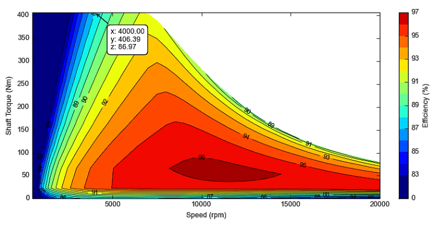

## Overview

 The propulsion subsystem directly supports mission objectives such as takeoff acceleration, climb capability, cruise speed, and terminal maneuverability. For expendable UAVs, additional priorities include robustness, tolerance to manufacturing variability, and predictable failure behavior rather than long-term maintainability.
The propulsion subsystem is responsible for generating thrust within defined performance envelopes while respecting electrical, thermal, mechanical, and control constraints imposed by the overall UAV system.

#### What is tolerance to manufacturing variability?

It is normal that two UAVs produced according to the same design are not exactly identical. The same applies to motor–ESC sets. The system must remain robust and capable of completing the mission despite such small differences.
Tolerance to manufacturing variability is particularly important for expendable UAVs, because for expendable UAVs;
- production is typically serial production
- cost pressure is high
- individual calibration or manual tuning is limited
- long maintenance or fine-tuning cycles are not expected.
This leads to the following design philosophy: 
1- wide operating ranges
2- conservative component selection
3- power and thermal design with margin
4- simple and repeatable architecture.

---

## 1. Electric Propulsion Systems for Expendable UAVs

Electric propulsion systems are widely used in expendable and target UAVs due to their simplicity, reliability, low acoustic signature, and minimal mechanical complexity.
Electric propulsion systems offer several architectural advantages. Control is simple and deterministic, as thrust is proportional to throttle command within predictable limits. There is no warm-up, ignition sequence, or fuel mixture variability. This simplifies operational procedures and reduces coupling between propulsion and mission timing.
However, electric propulsion introduces specific system-level constraints. High instantaneous current draw can stress wiring, connectors, and power distribution. Electromagnetic interference generated by ESC switching can affect avionics if grounding and routing are not properly controlled. Thermal dissipation of motor and ESC must be addressed, especially in enclosed fuselage installations where airflow is limited.
From a system-engineering perspective, electric propulsion should be treated not merely as a motor, but as an integrated subsystem that converts stored electrical energy into controlled thrust while interfacing cleanly with avionics, power, and structural subsystems.
At system level, an electric propulsion chain consists of 

- energy source (battery)
- power and control element (Electronic Speed Controller, ESC)
- electromechanical actuator (brushless DC motor)
- an aerodynamic load (propeller).

### 1.1 Battery

The battery is an inseparable part of electric propulsion performance. Battery internal resistance, discharge capability, and voltage sag under load directly affect available motor power. From a propulsion perspective, the system engineer is less concerned with battery chemistry details and more concerned with whether the propulsion system can draw peak current without triggering undervoltage cutoffs, ESC resets, or flight-critical brownouts.

#### What is battery internal resistance?

Battery internal resistance represents the electrical resistance inside the battery that opposes current flow. When the propulsion system draws high current, this internal resistance causes a voltage drop within the battery itself.
#### What is discharge capability?

Discharge capability refers to the maximum current a battery can safely supply to the propulsion system. It determines whether the battery can support peak motor power during demanding flight conditions such as launch or climb. 
If the required motor current exceeds the battery’s discharge capability, excessive voltage drop, overheating, or protection shutdown may occur, reducing available thrust and potentially compromising the mission.
Battery discharge capability is usually expressed using C-rating.
The relation is:

$$I_{max} = C_{rating} \cdot \text{capacity}$$

Example:  = 5Ah
battery rating = 20C
Maximum current = 5 Ah x 20 = 100 A
So the battery can theoretically deliver 100A safely.

#### What is voltage sag?

Voltage sag describes the temporary reduction in battery output voltage when high current is drawn by the propulsion system.
Voltage sag results primarily from the battery’s internal resistance and becomes more pronounced as current demand increases or the battery state of charge decreases. 

$$V_{real} = V_{nominal} - I \cdot R_{internal}$$

Where:

$V_{real}$ = actual battery voltage under load 

$V_{nominal}$ = reference (or label) battery voltage

I = current 

$R_{internal}$ =battery internal resistance

Excessive voltage sag can reduce motor thrust and may push the electrical system below safe operating limits for avionics or control electronics.

#### What are undervoltage cutoffs?

Undervoltage cutoff is a protective mechanism implemented in ESCs or power management systems to prevent the battery from being discharged below a safe voltage threshold. 
When battery voltage falls below this limit, the ESC may reduce motor power or shut down the motor entirely. While this protects the battery from damage, it can also result in sudden loss of propulsion if the system is not designed with sufficient voltage margin.

#### What is ESC resets?

ESC resets occur when the voltage supplied to the electronic speed controller momentarily drops below the minimum operating level required by its internal electronics. 
In such cases, the ESC may reboot or temporarily stop driving the motor phases. During flight this can cause abrupt thrust interruptions, which may destabilize the vehicle or lead to loss of control in systems that rely on continuous propulsion.

#### What is flight-critical brownouts?

A brownout occurs when system voltage drops low enough to disrupt the operation of avionics components such as the flight controller, sensors or communication systems. 
Unlike propulsion-only interruptions, brownouts affect the vehicle’s ability to maintain control or navigate properly. In extreme cases the flight controller may reboot, leading to temporary loss of stabilization and potentially catastrophic mission failure.
For this reason, propulsion power systems must be designed with sufficient electrical margin to prevent voltage collapse under peak load conditions.

### 1.2 Electronic Speed Controller (ESC)

The Electronic Speed Controller (ESC) acts as both a power converter and a control interface within the electric propulsion system. It translates low-power throttle commands from the flight control computer into high-current, three-phase drive signals required by the brushless motor. In this sense, the ESC bridges the avionics domain and the high-power electrical domain of the propulsion system.
Positioned between the battery and the motor, the ESC converts the battery’s direct current (DC) into a controlled three-phase alternating current that drives the motor windings. By adjusting the switching frequency and duty cycle of these signals, the ESC regulates motor rotational speed and torque, thereby controlling the thrust produced by the propeller.
From a system-engineering perspective, the ESC performs several critical functions within the propulsion chain:

- Motor speed control: regulating motor RPM in response to throttle commands from the flight controller.
- Torque response: enabling rapid torque response for thrust control during flight maneuvers.
- Electrical power conversion: converting battery DC power into the three-phase signals required by the motor.
- Protection mechanisms: safeguarding the propulsion system through functions such as over-current protection, thermal protection, and low-voltage cutoff.

Because the ESC directly interfaces with both the propulsion hardware and the avionics control system, its behavior under transient electrical loads, voltage drops, and thermal stress must be carefully considered. In many UAV architectures, ESC malfunction or reset can lead to immediate propulsion loss, making it a potential single-point failure within the propulsion subsystem.
For this reason, ESC selection and integration must account for current margins, thermal management, and reliable communication with the flight control system to ensure stable propulsion performance under all expected operating conditions.

#### What is single-point failure?

A single-point failure is a condition in which the failure of a single component, interface, or function directly leads to the loss of a required system function, without any redundancy, mitigation mechanism, or graceful degradation.
An SPF is directly characterized by:

- Failure of an single element.
- Immediate or predictable loss of a required system function.
- Absence of alternative paths or backup mechanisms.

Importantly, the SPF concept is architectural rather than probabilistic. A component may be highly reliable, but if its failure leads directly to loss of a critical function, it still constitutes a single-point failure.

The followings are not single-point failure:

- Failures that can be bypassed through alternative paths
- Failures that only result in reduced performance
- Conditions from which the system can autonomously recover
- Failures affecting non-critical functions
  
An SPF always implies loss of mission capability or violation of a safety objective.

Example: ESC as a Single-Point Failure
If the ESC is lost, thrust is lost. Therefore, ESC failure is a single-point failure.
Loss of the ESC results in immediate loss of thrust. In the absence of redundancy, this leads directly to propulsion failure.
Typical ESC failure mechanisms include:

- Overcurrent → ESC shutdown
- Voltage drop → ESC reset
- Thermal overload → power stage failure
- Firmware lockup
- EMI-induced control loss
- Connector or solder joint failure
  
These mechanisms demonstrate that both electrical and physical causes can lead to the same system-level consequence: loss of propulsion.

#### SPF and Redundancy in expendable UAVs

In traditional safety-critical systems such as aviation, railway, and nuclear systems, SPFs are systematically eliminated through redundancy and fault-tolerant design.
In expendable or target UAVs, however, weight, cost, and simplicity constraints dominate. As a result, redundancy is often intentionally minimized or eliminated.
Therefore, SPFs are not always removed but instead, identified, understood, accepted and mitigated where possible.

#### Managing accepted single-point failures

When elimination of SPFs is not feasible, systems engineering focuses on reducing their likelihood and impact through:

1. Design margin (Ensuring electrical, thermal, and mechanical margins to prevent operation near failure limits)
2. Environmental control (Managing temperature, EMI, wiring layout, and grounding to reduce stress on critical components)
3. Interface discipline (Ensuring signal integrity (e.g., clean PWM), proper separation of power domains, and prevention of brownouts) 
4. Predictable failure behavior (Designing the system such that failures occur in a controlled and foreseeable manner)

### 1.3 Brushless DC Motor

The brushless DC motor is the core thrust-producing element. From a system perspective, the motor is characterized not only by its power rating, but also by its torque-speed relationship, efficiency map, thermal limits, and inertia. These characteristics influence acceleration response, steady-state thrust, and the electrical load imposed on the power system. Motor selection therefore impacts avionics power stability, battery sizing, and thermal margins.

#### What is Torque – Speed Relationship of a Brushless DC Motor?

Even when an electric motor is not rotating, torque is produced on the rotor as soon as it is energized. Zero rotational speed does not imply zero torque.
Electric motors can produce high torque at low speeds. As rotational speed increases, the torque that can be produced decreases. At very high speeds, approaching the no-load speed, the available torque approaches zero.
The general characteristic of brushless DC motors can be summarized as follows:

1. Speed = 0 (startup condition) → torque is maximum
2. As speed increases → available torque decreases
3. At very high speed (no-load speed) → torque ≈ 0
   
As the motor speed increases, the torque capability decreases progressively. This is primarily due to the increase in back electromotive force (back-EMF), which reduces the effective current flowing through the motor windings. Since torque is proportional to current, a reduction in current leads to a reduction in torque.
In practical terms:

- Higher torque demand requires higher current draw (torque ∝ current).
- If the propeller load is high, the motor demands more torque, which results in increased current draw.
- This increased current places higher stress on the ESC and the battery.
  
#### What is Efficiency Map?
An efficiency map shows how efficiently the motor operates at different combinations of speed and torque. It provides a visual representation of motor performance across its operating range and makes the torque–speed relationship more explicit.
Efficiency is defined as:
Efficiency = Mechanical output power / Electrical input power
A typical efficiency map shows:

- Low speed + high torque → low efficiency
- Very high speed → low efficiency
- An intermediate region (“sweet spot”) → high efficiency
  
In UAV applications:

- During takeoff, the motor operates at high load for a short duration.
- During most of the mission, the UAV operates at cruise conditions with relatively steady thrust.
  
Therefore, the motor–propeller combination should be selected such that the cruise operating point (typically 70–80% of mission time) lies within the high-efficiency region.

*Figure 3.1 — Efficiency Map*

If the cruise operating point lies in a low-efficiency region:

- Battery discharges faster
- Heat generation increases
- Endurance and range decrease
  
In practice, complete efficiency maps are often not available for every motor.

#### What are thermal limits?

Thermal limits define how much heat the motor can tolerate and how that heat is generated.
Primary heat sources include:

- Resistive losses in windings (I²R losses)
- Magnetic (core) losses
- Mechanical losses (e.g., bearing friction)
  
Thermal limits typically include:

- Maximum winding temperature
- Demagnetization limits of permanent magnets
- Continuous vs. peak power ratings
  
Exceeding these limits can lead to:

- insulation degradation
- loss of magnetic performance
- permanent motor damage
  
#### What is inertia?

Inertia represents the resistance of the rotating system – comprising the motor rotor and propeller – to changes in rotational speed.
As inertia increases, changes in rotational speed become slower, and the system response time increases. This directly affects how quickly thrust can increase or decrease in response to throttle commands.
From a system perspective, inertia influences:

- throttle response time
- rate of thrust increase and decrease
- stability of control loops
  
Higher inertia results in a smoother but slower response, while lower inertia enables faster but more abrupt changes in thrust.
Propeller geomerty has a strong influence on inertia. Larger and heavier propellers increase the overall rotational inertia of the system. As a result:

- Large propellers → higher inertia → slower but smoother response
- Small propellers → lower inertia → faster but more aggressive response
  
For expendable UAV, higher inertia is often advantagenous because it provides stable and smooth thrust behavior, which can simplify control and improve robustness.
However, inertia must be considered alongside motor torque capability and control system requirements during propulsion system design.

### 1.4 Propeller

The propeller is the final energy conversion element, transforming shaft power into thrust. In system terms, the propeller defines the aerodynamic load seen by the motor and ESC. Propeller diameter, pitch, and blade count affect thrust, efficiency, noise, and current draw. A propulsion system cannot be evaluated without considering the propeller, because motor performance data is meaningless in isolation from its aerodynamic load.
Propeller performance is often characterized using the advance ratio, which relates forward flight speed to rotational speed. This parameter determines the operating regime of the propeller and strongly influences efficiency.
Propeller loading and efficiency differ significantly between static conditions (e.g., takeoff) and forward flight. A propeller optimized for static thrust may operate inefficiently in cruise, and vice versa.
Propeller power requirements increase nonlinearly with thrust, meaning that small increases in thrust demand can result in disproportionately higher power consumption.
Disk loading, defined as thrust per unit propeller disk area, is a key parameter influencing efficiency. Lower disk loading (larger propellers) generally improves propulsive efficiency but may be constrained by geometry and integration.

#### Motor – Propeller Matching

Propeller selection is primarily driven by aerodynamic requirements, such as required thrust, flight speed, and mission profile. However, the selected propeller defines the mechanical load on the motor and therefore directly influences current draw, efficiency, and thermal behavior of the propulsion system. As a result, propeller selection must be performed in conjunction with motor and power system constraints.
The motor and propeller must be selected as a coupled system, not as independent components. The propeller defines the aerodynamic load, while the motor must provide the required torque and rotational speed to drive that load efficiently and safely.
From a system perspective, the propeller imposes a torque demand on the motor that increases with rotational speed and blade geometry (diameter, pitch, and airfoil characteristics). The motor responds to this demand by drawing current from the battery. Therefore, the motor-propeller combination directly determines:

- current draw from battery
- load on the ESC
- operating point on the motor efficiency map
- thermal loading of the propulsion system

A mismatch between motor and propeller can lead to several undesirable conditions:

- overloading condition: a large or aggressive propeller may require more torque than the motor can efficiently deliver, resulting in excessive current draw, overheating, and potential ESC or battery stress.
- underloading condition: a small propeller may not fully utilize the motor’s capability, leading to inefficient operation at high speed and reduced thrust efficiency.

In a properly matched system, the motor operates within its safe current and thermal limits, while the propeller produces the required thrust at an efficient operating point.
For UAV applications, particular attention should be given to the cruise condition, where the system spends most of its operating time. The motor-propeller combination should be selected such that this operating point lies within the motor’s high-efficiency region.
In practice, motor-propeller matching is often performed iteratively using:

- manufacturer data
- test measurements
- simplified analytical or numerical models

Because complete motor maps and propeller performance data are often unavailable, engineering judgment and conservative design margins are essential.

## 2. Gasoline Two-Stroke Propulsion Systems

Liquid fuels have a significantly higher energy density compared to batteries. The energy density of gasoline is approximately 43 MJ/kg, whereas Li-Po batteries typically range between 0.6 and 0.9 MJ/kg. This means that, for the same mass, gasoline can store roughly 40 to 70 times more energy than a battery.
However, energy density alone is not sufficient to evaluate propulsion performance. While electric motors operate with efficiencies in the range of 85–95%, small gasoline engines typically achieve only 20–30% efficiency.
In other words, although gasoline carries a large amount of energy, a significant portion of this energy is lost as heat during conversion. Despite this, gasoline propulsion remains advantageous for long-endurance missions.
Gasoline two-stroke propulsion systems are commonly used in expendable UAVs when endurance, range, or fuel energy density becomes the dominant driver rather than simplicity. From a system-engineering perspective, a two-stroke engine is not just a power source; it is a multi-domain subsystem that tightly couples mechanical, thermal, fluid, control, and operational behaviors.
Unlike electric propulsion, gasoline propulsion converts chemical energy directly into mechanical shaft power without an intermediate electrical energy buffer. This architectural difference fundamentally changes how the system behaves under load, during transients, and in failure scenarios.
At system level, a gasoline two-stroke engine provides; continuous shaft power over long durations, high energy density via liquid fuel and relatively contant power capability independent of battery state. However it also introduces; combustion dynamics, vibration and mechanical fatique, thermal management requirements and fuel delivery and ignition dependencies. This makes gasoline propulsion achitecturally more complex than electric propulsion.

### 2.1 Torque and Speed Characteristics in System View

A two-stroke engine:

- cannot generate torque at zero speed
- must be spinning to produce power
- has a defined idle speed below which it stalls
  
This means; unlike electric motors, a gasoline engine cannot produce stall torque. 
This has immediate consequences:

- the engine must be started and kept running
- the propeller load must not force RPM below idle
- Throttle response is inherently slower and less deterministic
  
Torque production in two-stroke engines is strongly tied to:

- Engine speed (RPM)
- Combustion efficiency
- Air-fuel mixture quality
  
As a result, thrust response is indirect, mediated by engine dynamics rather than direct electromagnetic torque.

### 2.2 Throttle control in gasoline propulsion-only
Throttle control in gasoline engines is not torque control, it is airflow control.
When throttle is increased:

- More air enters the engine
- More fuel is drawn or injected
- Combustion pressure rises
- Torque increases indirectly
  
This introduces:

- Response lag
- Sensitivity to mixture tuning
- Dependence on ambient conditions (altitude, temperature)
  
From a system-engineering standpoint, throttle commands are requests, not guarantees.

### 2.3 Fuel – Air Mixture Sensitivity

Two-Stroke engines rely on a correct air-fuel ratio to operate safely.
If the mixture is:

- too lean → overheating, detonation, engine damage
- too rich → power loss, fouling, unstable combustion
  
This sensitivity means that:

- Fuel system behavior directly affects propulsion reliability
- Environmental variations matter
- Manufacturing variability in carburetors or injectors propagates into thrust variability
  
System engineers therefore treat fuel mixture control as a propulsion risk driver, not a detail.

### 2.4 Thermal Behavior and Limits

Thermal behavior in gasoline engines is more severe and less forgiving than in electric systems.
Key points:

- Combustion temperatures are very high
- Cooling is typically air-based
- Overheating can occur gradually but lead to catastrophic failure
  
Unlike ESCs, which may shut down protectively, engines often:

- Continue operating while damaging themselves
- Fail suddenly after thermal limits are exceeded
  
This makes thermal margins and airflow integration critical architectural concerns.

### 2.5 Mechanical Vibration and Structural Coupling

Two-stroke engines generate:

- Cyclic combustion forces
- Rotational imbalance
- High vibration levels 
  
From a system perspective, vibration:

- Couples into the airframe
- Affects avionics reliability
- Drives mounting and isolation requirements 
  
Unlike electric motors, vibration is intrinsic and cannot be eliminated—only managed.

### 2.6 Failure Modes and Single-Point Behavior

Gasoline propulsion introduces multiple potential single-point failures, including:

- Ignition system failure
- Fuel starvation
- Carburetor or injector malfunction
- Mechanical seizure
- Loss of lubrication (oil–fuel mixture issues) 
  
In most expendable UAV architectures; The engine and its control unit (ECU or ignition module) together form a single-point failure for propulsion, similar in role to the ESC in electric systems.

However, gasoline failures are often:

- Progressive rather than instantaneous
- Harder to detect electronically
- Less predictable in timing
  
### 2.7 Operational and Integration Implications

From a system-engineering viewpoint, gasoline propulsion affects:

- Ground procedures (fueling, priming, starting)
- Launch sequencing
- Abort logic
- Safety envelopes

Electric propulsion is largely “power on → thrust available”.
Gasoline propulsion is procedural, state-dependent, and timing-sensitive.

## 3.  Fuel System Fundamentals
The fuel system is not a support detail of gasoline propulsion. It is a mission-critical enabling subsystem. The fuel system exists to deliver the correct amount of fuel, at the correct time, in the correct condition, to the engine under all anticipated operating conditions.
Any failure or deviation in the fuel system propagates directly into propulsion instability, thrust loss, or engine damage. Therefore, fuel systems must be analyzed not only for functionality, but also for robustness against operational, environmental, and manufacturing variability.

###3.1 System-Level Function of the Fuel System

At system level, the fuel system must:

- Store fuel safely
- Deliver fuel continuously
- Maintain a stable air-fuel mixture
-Operate across attitudes, accelerations, and vibrations
- Remain functional throughout the entire mission profile
  
This function must be satisfied without pilot intervention, often with no closed-loop sensing, which makes the fuel system a high-risk, low observability subsystem.

### 3.2 Core Components of a Typical UAV 

A simple two-stroke UAV fuel system typically consists of:

- Fuel tank
- Fuel pickup (clunk or fixed pickup)
- Fuel lines and fittings
- Primer bulb or priming mechanism
- Carburetor or injector
- Venting system

Each of these elements introduces its own failure modes, and none can be treated as optional.

### 3.3 Fuel Tank Considerations

The fuel tank is not just as a container. It must:

- Supply fuel regardless of UAV attitude
- Avoid fuel starvation during acceleration or maneuvering
- Withstand vibration and pressure changes
- Prevent vapor lock and air ingestion
  
#### What does “supply fuel regardless of UAV attitude mean?

During flight, the fuel inside the tank is subjected to gravity, linear acceleration (launch, throttle changes), angular acceleration (pitch, roll, yaw) and vibration.
Fuel behaves like a moving liquid mass, not a rigid body. If the fuel pickup momentarily loses contact with liquid fuel, the engine draws air instead of fuel, even if the tank is half full. That is fuel starvation. Fuel tanks are explicitly designed to manage fuel motion.

#### What is vapor lock?

Vapor lock is a condition where fuel vaporizes when it should remain in a liquid state. 
It happens when: 
Fuel line heats up: Excessive heat is transferred to the fuel system.
Pressure drops: This can be due to high altitude, suction issues, or overly long fuel hoses.
Fuel begins to boil: The combination of heat and low pressure reaches the fuel's boiling point.
All of this results in vapor bubbles forming inside the fuel lines. Since carburetors and injectors are designed to process liquid fuel, and vapor does not flow or pump as effectively, the fuel supply becomes erratic. This typically occurs during hot weather, extended high-load operations, or due to poor hose routing (e.g., lines placed too close to exhaust components).

#### what is air ingestion?

Air ingestion refers to the entry of air into the fuel line. This typically occurs when the fuel pickup (or clunk) becomes exposed to the air, often due to fuel sloshing inside the tank during maneuvers. It can also be caused by loose or cracked hoses, or faulty tank venting. As a result, the system draws in air instead of fuel. When this happens, the fuel-air mixture suddenly becomes "lean," causing the engine to sputter, lose RPM, or even stall completely.

### 3.4 Fuel Pickup and Attitude Sensitivity

Because UAVs operate in varying orientations, the fuel pickup must remain submerged in fuel.
Typical solutions include:

- Weighted flexible pickup (“clunk”)
- Carefully positioned fixed pickup for limited maneuver envelopes
  
If the pickup draws air instead of fuel, the engine may:

- Hesitate
- Lose RPM
- Stop completely
  
This makes fuel pickup behavior a dynamic interface problem, not a static design detail.

### 3.5 Fuel lines, fittings, and leakage risk

Fuel lines are deceptively simple but system-critical.
They must:

- Resist fuel chemistry
- Withstand vibration
- Maintain sealing over temperature changes
- 
A partially collapsed or leaking fuel line does not always cause immediate failure. Instead, it may:

- Lean the mixture gradually
- Increase engine temperature
- Trigger progressive damage
- 
This links fuel lines directly to the “progressive rather than instantaneous” failure behavior.

### 3.6 Priming and Starting Dependency

Unlike electric propulsion, gasoline engines require fuel to already be present at the carburetor during start.
Priming mechanisms exist to:

- Remove air from fuel lines
- Ensure combustible mixture during ignition
  
Improper priming leads to:

- Failed start
- Flooding
- Unstable idle
  
This introduces state-dependent and procedural dependency into propulsion availability.

### 3.7 Carburetion and Mixture Stability
Most small UAV engines use simple carburetors, not closed-loop injection systems.
This means:

- Mixture depends on airflow, pressure, and fuel head
- Altitude and temperature directly affect mixture
- Manufacturing tolerances affect needle settings
  
The fuel system therefore becomes a control-quality limiter for propulsion.

### 3.8 Fuel System Failure Modes

Typical fuel-system-driven failures include:

- Fuel starvation
- Vapor lock
- Air ingestion
- Leakage
- Blockage or contamination
- Improper venting
  
Many of these failures:

- Develop gradually
- Are not electronically detectable
- Manifest first as thrust instability
  
Thus, the fuel system is often a hidden single-point contributor to propulsion loss.

### 3.9 Interfaces with Other Subsystems

The fuel system interfaces with:

- Propulsion (engine)
- Structure (tank mounting, vibration transmission)
- Thermal environment (fuel temperature, vaporization)
- Operations (fueling, priming, storage)
  
These interfaces must be anticipated at architecture definition time.
