# Overview

Avionics is the subsystem that turns a mechanically flyable airframe into an autonomous, controllable system.

Avionics sits at the center of the UAV system architecture. It interfaces upward with the operator and ground control station, sideways with propulsion and payload subsystems, and downward with sensors and actuators. 

The primary role of avionics is to close the control loop. Sensors observe the state of the vehicle and its environment, the flight controller processes this information and computes control actions, and actuators execute those commands on the airframe. This loop runs continuously and deterministically, typically at tens to hundreds of hertz, and its stability and reliability directly determine whether the aircraft flies safely or not.

Another key role of avionics is command interpretation and execution. Commands may come from a preloaded mission, from a ground control station, or from internal safety logic such as failsafes. Avionics translates abstract commands like "maintain altitude" or "go to waypoint" into concrete actuator outputs such as servo deflections and throttle signals.

From a system boundary perspective, avionics acts as an integration hub. It aggregates inputs from multiple sensors with different update rates and error characteristics, manages power and signal interfaces, and distributes outputs to actuators and communication links. Because of this central role, avionics design strongly influences wiring architecture, connector choices, redundancy philosophy and overall system complexity.

Finally, avionics is a major driver of system behavior in abnormal conditions. Loss of GNSS, sensor noise, voltage drops, or communication loss are not purely electrical problems; they become system-level events handled by avionics logic. How the UAV reacts — whether it continues, degrades gracefully, or terminates the mission - is defined largely by avionics design choices.

The avionic system's specific roles are:

- stabilization: keeping the aircraft from diverging from its intended attitude
- navigation: knowing where the aircraft is, where it's going and how fast
- guidance: computing the path to follow
- control: commanding control surfaces and throttle to follow the path
- communication: exchanging data with the ground (commands in, telemetry out)
- health monitoring: detecting faults and triggering safe responses

Here is an overview of the full avionics architecture we'll work through:

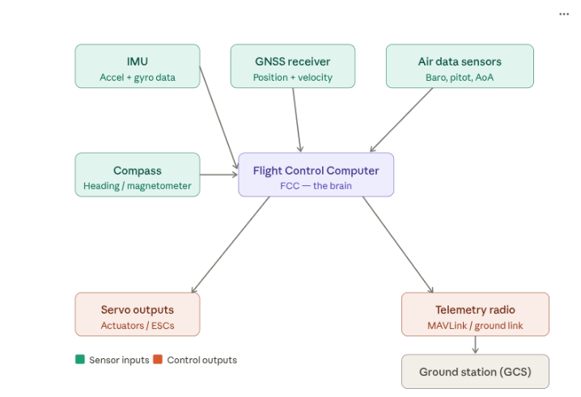

*Figure 4.1 — avionics architecture*

## 1. Flight Control Computer (FCC)

The Flight Control Computer (FCC), often referred to as the autopilot, is the central processing element of the avionics system. It is the component that receives all sensor information, executes estimation and control algorithms, applies system logic and constraints, and generates commands for the actuators.

The FCC serves three simultaneous roles:

1- Sensor data concentrator — it collects raw or preprocessed data from inertial sensors, navigation sensors, and air data sensors

2- Control-law executor — it runs estimation algorithms to infer vehicle state, then computes control outputs that stabilize and guide the aircraft

3- System supervisor — it monitors health, manages flight modes, and enforces safety responses

These functions are tightly coupled and executed in deterministic, cyclic loops — meaning the FCC performs them repeatedly, in a fixed sequence, at a guaranteed rate. This determinism is not optional; it is a fundamental requirement of any real-time flight control system.

At the interface level, the FCC is a many-to-many node. It has multiple sensor inputs with different update rates and timing constraints, multiple actuator outputs that require precise and regular signaling, and optional communication links to external systems such as telemetry radios or payload controllers. Because of this, the FCC defines much of the electrical, data and timing architecture of the UAV. When a systems engineer draws the wiring and interface diagram of a UAV, the FCC sits at the center of almost every connection.

The FCC is also responsible for flight mode management. Even in a simple drone, there is more than one operational mode, such as manual stabilization, attitude hold, navigation mode or failsafe behavior. The FCC arbitrates between these modes based on operator commands, mission phase and internal health checks. This ensures that only one coherent control strategy is active at any given time.

From a control standpoint, the FCC closes multiple nested loops. At the lowest level, it stabilizes angular rates and attitudes by commanding control surfaces or motor speeds. At higher levels, it may regulate altitude, airspeed, or trajectory. While the mathematical details are abstracted away in this course, it is important to understand that all control authority ultimately originates from the FCC.

The FCC also acts as the system safety gatekeeper. It monitors sensor validity, power levels, communication status, and internal timing. When abnormal conditions are detected—such as loss of GNSS, excessive attitude error, or brown-out risk—the FCC enforces predefined responses. These responses may include mode changes, limiting control outputs, or executing termination logic in expendable systems.

In terms of physical implementation, the FCC is typically a compact embedded computer built around a microcontroller (MCU) or system-on-chip (SoC), running a real-time operating system (RTOS). Common examples in the UAV industry range from dedicated autopilot boards (with integrated IMU, barometer, and power regulation) to custom embedded designs.

However, from a systems-engineering viewpoint, the physical form of the FCC is less important than its functional responsibilities and interfaces. Whether it is a commercial autopilot or a custom board, its role in the system architecture remains fundamentally the same.

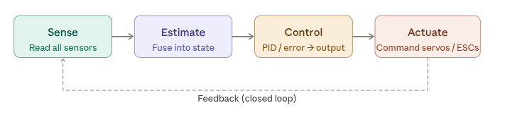

*Figure 4.2 — Processing Architecture — A Brief Comparison*

In expendable UAVs — systems designed for a single mission with no recovery — FCC selection and configuration prioritize robustness and simplicity over flexibility. Advanced features such as adaptive control, complex redundancy management, or high-level autonomy are often unnecessary.

Instead, the FCC must:

- Reliably perform a small, well-defined set of functions
- Operate correctly under known environmental conditions
- Fail predictably when those conditions are violated

Predictable failure behavior is as important as normal operation in expendable system design. This is a key systems-engineering mindset shift from general aviation thinking.

In summary, the Flight Control Computer is the decision core of the UAV. It transforms sensor measurements into understanding, understanding into commands, and commands into physical motion. 

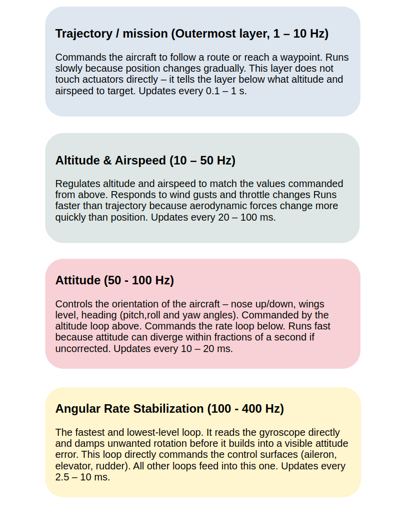

*Figure 4.3 — FCC's roles as a summary*

It is simultaneously a data hub, a control engine, a mode manager, and a safety monitor. Every design decision in the avionics architecture — sensor selection, interface choices, redundancy philosophy — is ultimately evaluated against what the FCC needs to do its job correctly.

#### What is nested control loops in a FCC?

A FCC doesn't control the aircraft with a single calculation. Instead, it runs several control loops simultaneously - one inside the other, like nested layers. Each layer has a specific job and runs at its own speed.

*Figure 4.4 — nested control loops*

## 2. Inertial Sensors (IMU)

An Inertial Measurement Unit, usually called an IMU, is the part of the avionics system that allows an aircraft to sense its own motion without relying on any external references. It works entirely by observing how the vehicle rotates and how forces act on it. Because it does not depend on satellites, radio signals, or the environment, the IMU is the most fundamental sensor used to keep an aircraft stable.

An IMU is made of two main types of sensors: gyroscopes and accelerometers. These sensors do not measure position, altitude, or direction directly. Instead, they measure very basic physical quantities — rotation rate and specific force —  and the flight control computer uses those measurements to infer how the aircraft is oriented and how it is moving.

Nearly all UAV-grade IMUs today are built using MEMS technology.

#### What is MEMS?

MEMS stands for Micro-Electro-Mechanical Systems. A MEMS sensor is a microscopic mechanical structure — typically a tiny mass suspended on flexible beams — etched directly into a silicon chip using the same manufacturing processes used to make computer processors. When the chip moves or rotates, the tiny mass deflects. That deflection changes an electrical signal, which is read by the chip's electronics and converted into a measurement. An entire MEMS IMU — containing three gyroscopes and three accelerometers — can fit on a chip a few millimeters across and weigh less than a gram. This makes MEMS IMUs ideal for UAV applications where size, weight, and power consumption are tightly constrained. The downside of small sensing masses is that MEMS sensors are more susceptible to noise, vibration, and temperature-induced errors than their larger, laboratory-grade counterparts.

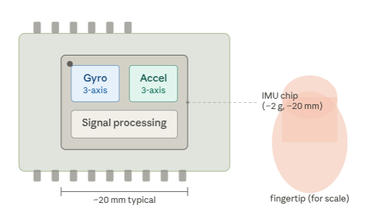

*Figure 4.5 — MEMS IMU chip scale diagram*

### 2.1 Three-Axis Concept

A complete IMU contains six sensors in total: three gyroscopes and three accelerometers, one of each aligned along each of the three body axes of the aircraft. These axes are defined relative to the airframe itself, not to the ground or to north.

The standard convention is:

- X axis — points forward along the fuselage (longitudinal axis)
- Y axis — points to the right along the wing (lateral axis)
- Z axis — points downward through the belly (vertical axis)

Each axis has an associated rotation. Rotation around X is called roll. Rotation around Y is called pitch. Rotation around Z is called yaw. The gyroscopes measure the rate of these rotations. The accelerometers measure forces along each axis.

This three-axis structure means the IMU can sense motion and rotation in any direction simultaneously. The diagram below shows the axes and their associated rotations on a fixed-wing airframe.

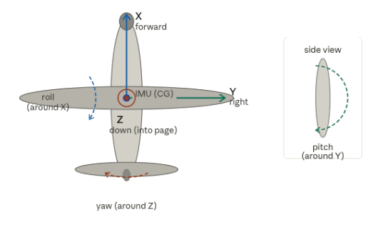

*Figure 4.6 — Fixed-wing UAV body frame axes diagram*

### 2.2 Gyroscopes — Measuring Rotation Rate

A gyroscope measures angular velocity — how fast the aircraft is rotating around an axis. It does not report an angle directly. It reports a rate: degrees per second, or radians per second. If the aircraft is not rotating, the gyroscope output is close to zero. As soon as rotation begins, the gyroscope detects it immediately.

This makes gyroscopes extremely useful for stabilization. They respond instantly to the onset of rotation, which is exactly what the innermost control loop needs to damp unwanted motion before it grows into a visible attitude error.

The FCC uses gyroscope data by integrating it over time. Integration means accumulating small rate measurements to estimate how much the orientation has changed. If the aircraft rotates at a measured rate for a short time interval, the computer multiplies rate by time to get the angle change, then adds that to the current estimated angle. Over short time intervals, this is very accurate.

Over longer intervals, however, small measurement errors accumulate. This slow growth of orientation error is called drift, and it is an unavoidable property of gyroscopes. The diagram below illustrates the drift effect.

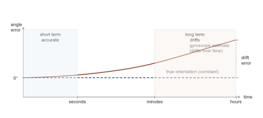

*Figure 4.7 — Gyroscope drift over time*

### 2.3 Accelerometers — Measuring Specific Force

An accelerometer measures specific force — the total force acting on its internal sensing mass per unit of mass. This includes the effect of gravity as well as any forces caused by motion: acceleration during a maneuver, or vibration from the airframe. An important point is that an accelerometer cannot distinguish between gravity and motion-induced forces. It measures the total combined force.

When an accelerometer is stationary on the ground, it does not read zero. It reads approximately 1 g — one gravitational acceleration — pointing upward. This is because the ground pushes the sensor upward against gravity, and the sensor interprets that reaction force as acceleration. This is a direct consequence of how accelerometers work physically.

This property is what makes accelerometers useful for attitude estimation, but only under specific conditions. When the aircraft is flying smoothly with no significant maneuvering, the dominant force acting on the accelerometer is gravity. In that case, the direction of the measured force vector corresponds to the direction of "down." By comparing this gravity vector to the aircraft body axes, the FCC can estimate roll and pitch angles.

The diagram below shows how the gravity vector projects differently onto the body axes depending on the aircraft's roll angle.

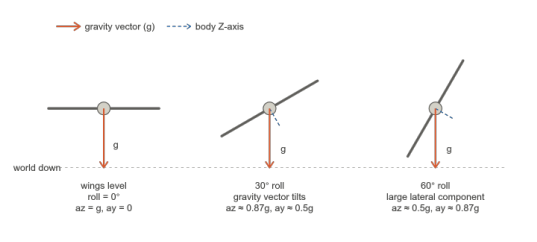

*Figure 4.8 — Accelerometer gravity vector at different roll angles*

However, during aggressive maneuvering, sharp turns, or turbulence, additional inertial forces act on the accelerometer and distort the gravity reading. In those conditions, the accelerometer cannot reliably indicate attitude. Its strength is providing a stable, low-frequency reference — not capturing fast motion.

### 2.4 Gyroscope and Accelerometer — How They Complement Each Other

The key insight behind IMU design is that gyroscopes and accelerometers have opposite strengths and weaknesses. They complement each other precisely because one is strong where the other is weak. The comparison table below summarises this:

*Table 4.1 — Comparison of Gyroscope and Accelerometer*

| | Gyroscope | Accelerometer |
|---|---|---|
| **Measures** | Rotation rate around each body axis | Total force per unit mass — gravity + inertial forces |
| **Short term** | ✅ Excellent — fast, responsive, accurate over seconds | ⚠️ Noisy — disturbed by vibration, maneuvers, turbulence |
| **Long term** | ⚠️ Drifts — integration error accumulates over minutes | ✅ Stable — gravity provides consistent reference when averaged |
| **During maneuvers** | ✅ Reliable — unaffected by inertial forces | ⚠️ Unreliable — cannot separate gravity from motion forces |
| **Primary use** | Inner loop stabilization, fast attitude rate control | Long-term attitude reference, drift correction |

By combining both sensors, the FCC obtains an attitude estimate that is responsive in the short term (from the gyroscope) and stable in the long term (corrected by the accelerometer). How this combination is performed mathematically is the subject of Section 4.11 — Sensor Fusion.

### 2.5 IMU Error Characteristics — Bias, Noise, and Temperature Sensitivity

For a systems engineer, it is not enough to understand what an IMU measures. It is equally important to understand how and why its measurements are imperfect. Three error characteristics dominate IMU performance specifications.

**Bias** is a constant or slowly varying offset in the sensor output. Even when the aircraft is perfectly stationary, a gyroscope with bias will report a small non-zero rotation rate. This offset is not random — it is repeatable but changes slightly with temperature and time. Bias is expressed in degrees per hour (deg/hr) for gyroscopes and in milli-g (mg) for accelerometers.

**Noise** is the random, high-frequency fluctuation in the sensor output. Every MEMS sensor has electronic and mechanical noise. Unlike bias, noise cannot be corrected by a single calibration — it must be filtered or averaged out. Noise determines how smooth the attitude estimate is at high frequency.

**Bias instability** is how much the bias changes over time during operation. Even after initial calibration removes the starting bias, the bias slowly wanders. This wandering is the primary driver of long-term gyroscope drift.

**Temperature sensitivity** compounds all of the above. MEMS sensor characteristics — including bias, scale factor, and noise floor — change with temperature. An IMU that is well-calibrated at room temperature may exhibit significantly different bias when the aircraft climbs to altitude and the chip cools. High-quality IMUs include onboard temperature sensors and apply temperature compensation curves to their outputs. For systems engineers, temperature sensitivity sets constraints on warm-up time, operational temperature range, and in-flight calibration strategy.

### 2.6 IMU Placement and Vibration Isolation

The IMU must be mounted as close as possible to the aircraft's center of gravity. Placing it away from the CG introduces additional lever-arm accelerations during rotation — the accelerometers will sense centripetal acceleration from yaw and pitch motions in addition to gravity and linear acceleration, polluting the attitude estimate.

Vibration is the most significant practical challenge in IMU installation. Propeller and motor vibration generates broadband mechanical noise at frequencies that directly contaminate MEMS sensor outputs. This vibration can alias into the attitude estimate, causing instability in the control loops.

The standard solution is vibration isolation — mounting the IMU on a soft damping structure that attenuates high-frequency mechanical energy before it reaches the sensors. The diagram below shows a typical vibration isolation mount cross-section.

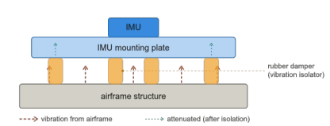

*Figure 4.9 — IMU vibration isolation mount cross-section*

The dampers absorb high-frequency mechanical energy from the airframe and prevent it from reaching the IMU. However, damper selection requires care: too soft a mount reduces vibration isolation but introduces low-frequency oscillation; too stiff a mount allows vibration to pass through. The correct stiffness is determined by the frequency content of the airframe vibration and the sensitivity band of the specific IMU.

### 2.7 IMU in the System Context

From a system perspective, the IMU is the foundation of all flight control. Without a functioning IMU, the aircraft cannot reliably determine its orientation, and controlled flight is not possible. Even if all other sensors — GNSS, air data, magnetometer — fail, a working IMU allows the aircraft to remain stabilized and controllable for a limited period.

In simple or expendable UAVs, IMUs are selected for adequacy and robustness rather than maximum precision. The goal is not to know the exact orientation with extreme accuracy, but to know it consistently and reliably enough to maintain stable flight and follow the intended flight path.

The IMU provides the FCC with its most fundamental sensory input: knowledge of how the aircraft is rotating and what forces are acting on it. Gyroscopes give fast, responsive rotation rate information that drives the innermost stabilization loops. Accelerometers provide a slower but stable gravity reference that corrects gyroscope drift over time. Together, mounted on vibration isolation and calibrated for temperature effects, they form the irreducible sensing core of any UAV avionics system.
Sensor fusion — the mathematical process of combining IMU data with GNSS, air data, and magnetometer information into a single consistent state estimate — is covered in Section 4.11.

## 3. Navigation Sensor (GNSS Receiver)

### 3.1 How GNSS Works

Navigation sensors provide the aircraft with long-term, absolute knowledge of where it is, how fast it is moving, and what time it is, referenced to the Earth. In small UAV systems, this role is almost always fulfilled by a Global Navigation Satellite System receiver, commonly referred to as a GNSS receiver.Unlike inertial sensors, GNSS does not infer motion from internal measurements - it determines position and velocity by observing signals transmitted from satellites orbiting the Earth. The term GNSS is an umbrella term. It refers collectively to all satellite-based navigation systems. GPS, GLONASS, Galileo, and BeiDou are each independent GNSS constellations operated by different nations. A GNSS receiver is a device that can listen to one or more of these constellations simultaneously. 

#### Pseudorange and position

A GNSS receiver estimates position by measuring the travel time of radio signals sent from multiple satellites. Each satellite continuously broadcasts a precisely time-stamped signal that includes its own orbital position. By comparing the transmission time encoded in the signal to the time of reception measured by the receiver's internal clock, the receiver computes the apparent distance to each satellite. This distance measurement is called pseudorange - "pseudo" because it contains an unknown error from the receiver clock offset, which is not as accurate as the satellite's atomic clock. With pseudorange measurements from at least four satellites, the receiver can solve a system of equations for four unknowns: latitude, longitude, altitude, and receiver clock offset. The result is an absolute position in an Earth-fixed coordinate system. The diagram below illustrates this geometry.

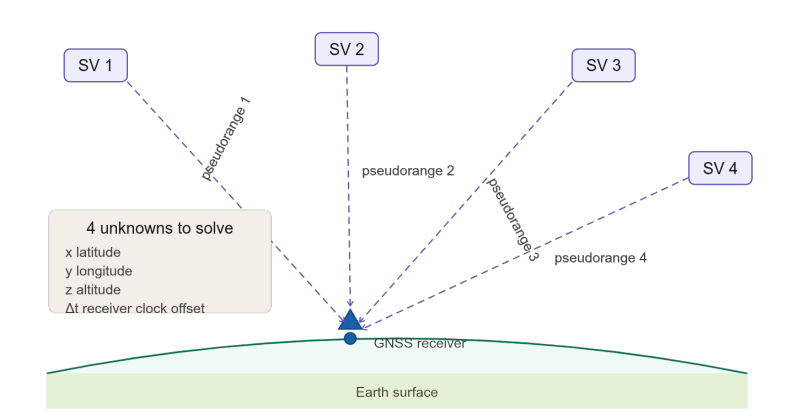

*Figure 4.10 — GNSS pseudorange geometry*

#### Velocity

Velocity is obtained in two related ways. The simpler method computes velocity as the time derivative of successive position estimates. This works but is noisy at low update rates. More commonly, modern GNSS receivers use the Doppler shift of satellite signals to estimate velocity directly. When the receiver is moving relative to a satellite, the received signal frequency shifts slightly from the transmitted frequency. This shift is proportional to the relative velocity component along the line of sight to the satellite. By combining Doppler measurements from multiple satellites, the receiver computes a three-dimensional velocity vector. This Doppler-based estimate is smooth, accurate, and does not drift - making GNSS velocity the primary source of groundspeed information in small UAVs.

#### Time

Time is a less obvious but equally critical GNSS output. Each satellite carries an atomic clock synchronized to a common GNSS time reference. The receiver, after solving for its clock offset, acquires a very precise absolute time. This time reference is used throughout the avionics system for sensor data timestamping, data logging, communication protocol synchronization, and in multi-vehicle systems, for coordinated mission execution.

#### System-level behavior

GNSS measurements arrive at much lower rates than inertial measurements - typically 1 to 10 Hz for standard receivers, and up to 25 Hz for high-rate configurations. This makes GNSS unsuitable for fast control loops. Its role is to correct long-term inertial drift and to enable mission-level navigation functions such as waypoint following and speed regulation.

GNSS performance depends strongly on environmental and installation factors. Signal quality can be degraded by poor antenna placement, airframe shadowing, electromagnetic interference, or limited satellite visibility. Multipath reflections - signals bouncing off surfaces before reaching the antenna - and poor satellite geometry introduce errors that can persist over time.

The relationship between GNSS and the FCC is cooperative rather than authoritative. The FCC evaluates GNSS data consistency, monitors health indicators. When GNSS is lost or degraded, the aircraft continues to fly using inertial sensing alone for a limited period, with reduced navigation accuracy. In expendable UAVs, loss of GNSS degrades mission performance but does not immediately threaten flight stability - stabilization relies on the IMU, not GNSS.

### 3.2 GNSS Constellations and Signals

#### The four main constellations

GNSS is not a single system. It is a family of independent satellite navigation constellations operated by different nations, each providing global or regional coverage. A modern UAV GNSS receiver is almost always a multi-constellation receiver - it tracks satellites from two or more systems simultaneously. This is a fundamental design choice: more satellites in view means better geometry, higher accuracy, and greater resilience to partial outages or interference. 

*Table 4.2 — The four operational global constellations*

| System | Operator | Satellites |
| :----: | :------: | :--------: |
| GPS | USA (DoD) | 31 operational - 6 orbital planes | 
| GLONASS | Russia (MoD) | 24 operational - 3 orbit planes |
| Galileo | European Union | 24+ operational - 3 orbit planes |
| BeiDou (BDS) | China (CNSA) | 24+ operational - mixed MEO / GEO / IGSO orbits |

All GNSS signals are transmitted in the L-band microwave range -roughly 1.1 to 1.5 GHz. Within this band, each constellation uses specific frequency allocations. This deliberate interoperability simplifies receiver antenna design and allows a single RF front end to process signals from multiple constellations.

#### Multi-constellation receivers

A multi constellation receiver tracks satellites from two or more constellations simultaneously. The practical benefit is a significant increase in the number of visible satellites at any time. A single-constellation GPS receiver in an urban or partially obstructed environment might see 6-8 satellites. A quad-constellation receiver (GPS + GLONASS + Galileo + BeiDou) may see 20 - 30 satellites simultaneously. More satellites improve geometry, reduce DOP (explained in following sections), and provide redundancy - if one constellation experiences interference or signal degradation, the others continue to function.

The Sky plot below illustrates the difference in satellite visibility between single and multi-constellation operation.

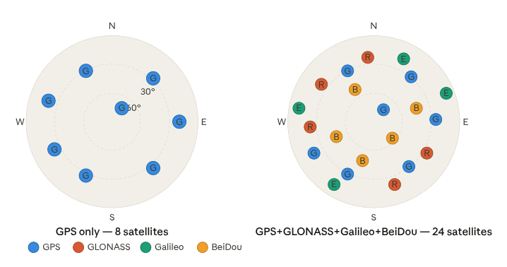

*Figure 4.11 — Sky plot comparing single constellation vs multi-constellation satellite visibility*

#### Interface to the FCC

A GNSS receiver connects to the FCC via a serial UART interface in almost all small UAV implementations. The receiver outputs either NMEA 0183 sentences - a text based, human-readable format - or proprietary binary protocol such as UBX (u-blox) or RTCM. Binary protocols are preferred in embedded systems because they are more compact and easier to parse reliably at high rates.

The receiver update rate is configurable. Standard configurations use 1 to 5 Hz for navigation. High-rate configurations can reach 10 to 25 Hz on modern receivers, which is useful when tightly coupling GNSS with the inertial estimator. The FCC reads position, velocity, fix type, DOP values, and satellite count from the receiver output on every update cycle.

### 3.3 GNSS Performance, Accuracy, and Augmentation

#### Satellite geometry and DOP

Having many satellites visible is beneficial, but the geometric arrangement of those satellites matters just as much as their number. If any visible satellites are clustered in one region of the sky, the intersection of their pseudorange spheres is poorly conditioned - small ranging errors produce large position errors. If satellites are spread evenly across the sky, the geometry is well conditioned and the same ranging errors produce small position errors.

This geometric quality is quantified by a parameter called Dilution of Precision, or DOP. DOP is a dimensionless number: lower values mean better geometry. HDOP refers specifically to horizontal geometry, PDOP to three-dimensional position geometry, and VDOP to vertical geometry. Practical thresholds used in UAV avionics are typically: HDOP below 1.5 is excellent, below 2.5 is acceptable, above 3.0 triggers warnings or navigation hold. The diagram below contrasts good and poor satellite geometry.

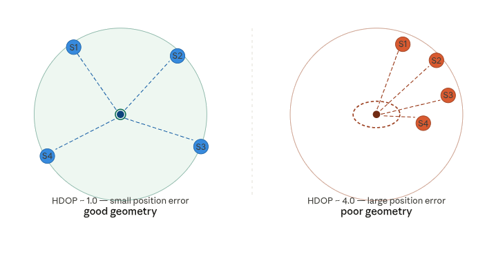

*Figure 4.12 — DOP geometry comparison - good vs poor satellite geometry*

## 4. Air Data Sensors

Air data sensors are used to determine how the aircraft is moving relative to the surrounding air, rather than relative to the Earth. This distinction is fundamental. While GNSS tells the aircraft where it is over the ground and how fast it is moving across the Earth's surface, air data sensors describe the aerodynamic state of the aircraft - which directly governs lift, drag, stall margin, and controllability.

The most common air data sensors in small fixed-wing UAVs are the pitot system and the barometric pressure sensor. Together, they allow the avionics system to estimate airspeed and pressure altitude - two quantities that cannot be obtained reliably from inertial or GNSS sensors alone.

Air data sensors are particularly important because aerodynamic forces depend on airspeed, not groundspeed. An aircraft flying into a strong headwind may have a low groudspeed. The same aircraft flying with a tailwind shows the opposite. Lift, stall margin, and control surface effectiveness all depend on airspeed. Relying on GNSS velocity alone for flight control would be insufficient and potentially dangerous.

### 4.1 The Pitot-Static System

The pitot-static system is the classical means of measuring airspeed in aviation. It consists of two pressure sensing ports:

- The **pitot port** faces directly into the oncoming airflow. It captures total pressure - the sum of static pressure and dynamic pressure. Dynamic pressure is the pressure rise caused by bringing the moving air to rest inside the tube, converting its kinetic energy into pressure.
- The **static port** is positioned to measure ambient atmospheric pressure undisturbed by the aircraft's motion. On simple UAV probes, the static port is typically a set of small holes on the side of the pitot tube body, away from the stagnation point.

The difference between total pressure and static pressure is the dynamic pressure. This relationship is expressed by Bernoulli's equation:

\[P_{dynamic} = P_{total} - P_{static} = \frac{1}{2} \rho V^2\]

where \(\rho\) is air density and V is true airspeed. From the measured dynamic pressure, the FCC computes airspeed. The diagram below illustrates the pitot-static probe and the pressure ports.

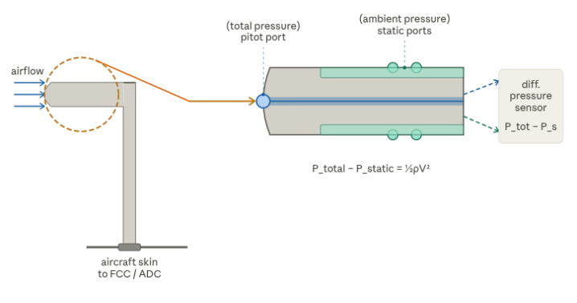

*Figure 4.13 — Pitot-static probe cross-section*

#### Relevance to fixed-wing UAVs

The pitot-static system is especially important on fixed-wing aircraft because, unlike multirotors, fixed-wing UAVs depend on airspeed to generate lift. Below a minimum airspeed - the stall speed - the wing can no longer produce sufficient lift to sustain flight. The FCC uses pitot-measured airspeed continuously to:

- Prevent stall by enforcing a minimum airspeed limit
- Regulate throttle to maintain commanded airspeed
- Scale control surface deflections appropriately for the current flight condition
- Trigger warnings or failsafes when airspeed drops below thresholds

Multirotors, by contrast, can hover and fly at any heading regardless of airspeed, so pitot systems are rarely fitted to them. For fixed-wing UAVs, the pitot system is a primary sensor.

### 4.2 Airspeed Measurement - Differential Pressure Sensor

The pitot-static pressure difference - dynamic pressure \(P{dynamic}\) - is measured by a differential pressure sensor. This is a MEMS device, similar in construction principle to the IMU sensors described in Chapter 2, that outputs a voltage or digital reading proportional to the pressure difference applied across its two ports. One port is connected to the pitot tube, the other to the static line.

From the measured dynamic pressure, the FCC computes indicated airspeed (IAS) using the inverted Bernoulli relationship:

\[ V = \sqrt{2 P_{dynamic} / \rho_{0}}\]

where \(\rho_{0}\) is the standard sea-level air density \((1.225 \, kg/m^3\)). This gives indicated airspeed - what the sensor directly measures, referenced to standard sea-level conditions. At altitude, where actual air density is lower than \(\rho_{0}\), indicated airspeed underestimates true airspeed.

\[V_{true}=V_{indicated} \, \times \,\sqrt{\rho_{0} / \rho_{actual}}\]

For most small UAV applications operating at low to moderate altitudes, the difference between indicated and true airspeed is small and often neglected. For systems engineers working on higher-altitude platforms, density correction becomes significant and requires a barometric altitude input to estimate actual air density.

#### Sensor characteristics

Differential pressure sensors used in UAV pitot systems are extremely sensitive - dynamic pressures at typical UAV airspeeds of 15 to 30 m/s are very small, on the order of 100 to 550 Pascal. Sensor selection must match the expected airspeed range: too large a full scale range reduces resolution at low airspeeds; too small a range risks saturation during high-speed flight or gusts.

Key parameters a systems engineer evaluates when selecting a differential pressure sensor:

- Full-scale pressure range (Pa) - must cover maximum expected dynamic pressure with margin
- Resolution and noise - determines minimum detectable airspeed change
- Temperature compensation - MEMS pressure sensors drift with temperature
- Interface - I2C or SPI digital output is standard in modern sensors, analog output requires an ADC on the FCC.

### 4.3 Barometric Altitude - Absolute Pressure Sensor

A barometric pressure sensor - also called an absolute pressure sensor or barometer - measures the total ambient static pressure at the aircraft's location. The Earth's atmosphere has a well-characterized pressure profile: pressure decreases monotonically with altitude. By comparing the measured pressure to a standard atmospheric model, the FCC can compute a pressure altitude.

The standard atmosphere model defines the relationship between pressure and altitude. At sea level, standard pressure is 101,325 Pa. At 1000 m, it is approximately 89,875 Pa. At 3000 m, approximately 70,120 Pa. The FCC uses this model to convert raw pressure readings into altitude estimates.

An important distinction: barometric altitude is not geometric height above the ground. It is height above the pressure reference level, which varies with weather. A passing low-pressure weather system will cause the barometer to report a higher altitude even if the aircraft has not moved vertically. This is a known and managed limitation - not a sensor defect.

#### Role in UAV avionics

In UAV avionics, the barometric altitude sensor serves two main roles:

- Altitude hold - the FCC regulates throttle and pitch to maintain a commanded pressure altitude. This is the primary altitude control mechanism in most autopilots.

- Vertical speed estimation - the rate of change of barometric altitude gives a vertical speed (climb or descent rate) estimate. This is sometimes called the barometric variometer output.

The barometric sensor is fast, self-contained, and requires no external signals. Its update rate - typically 25 to 100 Hz in modern MEMS barometers - is much higher than GNSS altitude, is noisier and slower, and has poor vertical accuracy compared to horizontal. In practice, barometric altitude and GNSS altitude are fused together in the state estimator, with the barometer providing the high-rate signal and GNSS providing long-term drift correction.

### 4.4 Sensor Errors and Limitations

Air data sensors are subject to several error sources that a systems engineer must understand and account for in the system design.

#### Position error

Position error is caused by the pitot-static probe being located in a region of disturbed airflow. The aircraft itself deforms the local pressure field around it. If the static port is placed where the local pressure differs from true ambient pressure - due to airframe interference, propeller wash, or fuselage curvature - the static pressure reading will be incorrect, and both airspeed and altitude estimates will be in error.

Mitigation: the pitot probe should be mounted on a forward-facing boom, as far from the fuselage and propeller as practical, in clean undisturbed air. For pusher-propeller configurations, this is easier to achieve than for tractor configurations.

#### Icing

At altitude and in certain meteorological conditions, supercooled water droplets in the air can freeze on contact with the pitot probe, blocking the ports. A blocked pitot port causes the total pressure reading to freeze or drop, producing incorrect - often dangerously low airspeed readings. A blocked static port traps the reference pressure, causing both airspeed and altitude to give incorrect readings as the aircraft climbs or descends.

Mitigation for manned aircraft involves electrically heated pitot probes. Most small UAVs do not carry heated pitot systems due to power constraints, so operational flight envelopes are typically restricted to avoid known icing conditions.

#### Blockage

Beyond icing, physical blockage of the pitot or static ports can occur from insects, dirt, water ingress, or damage. Pre-flight inspection of pitot probe ports is a standard checklist item. In the avionics software, sudden step changes in airspeed or anomalous pressure readings can trigger blockage detection logic in the FCC.

#### Turbulence and dynamic effects

In turbulent air, dynamic pressure fluctuates rapidly. The pitot sensor output becomes noisy, and the computed airspeed varies. Low-pass filtering is applied in the FCC to smooth airspeed estimates, but excessive filtering introduces lag - a trade-off the systems engineer must tune for the specific aircraft and mission environment.

### 4.5 Air Data Computer (ADC) - concept

In manned aviation, an Air Data Computer is a dedicated processing unit that takes raw pressure inputs from the pitot-static system and outputs computed air data parameters - airspeed, altitude, vertical speed, Mach number, and outside air temperature - to the rest of the avionics suite. It handles all the sensor compensation, atmospheric model calculations, and data formatting internally, presenting clean engineering-unit outputs over a standardized bus.

In small UAV systems, there is rarely a separate ADC unit. Instead, the ADC function is distributed: the differential pressure sensor and barometric sensor connect directly to the FCC, and the FCC firmware performs all the air data computation internally - computing airspeed from dynamic pressure, deriving vertical speed from barometric rate of change, and applying any calibration corrections.

#### System-Level Considerations

From a system design perspective, air data sensors occupy a supporting role - they inform and improve the quality of navigation and control, but they are not the primary stabilization sensors. Loss of air data in a fixed-wing UAV typically degrades mission performance rather than immediately causing loss of control. Attitude stabilization continues using inertial sensors. However, airspeed regulation becomes unreliable, stall protection is lost, and altitude hold degrades to GNSS-based altitude control, which is coarser and slower.

In simple or expendable UAV architectures, the pitot system is sometimes omitted entirely. In those cases the FCC uses GNSS groundspeed as a coarse proxy for airspeed and applies conservative airspeed margins to compensate for wind uncertainty. This is an acceptable trade-off in benign wind conditions but degrades safety margins in strong or variable winds.

When air data is included, it improves efficiency, safety margins, and mission robustness - but it also adds system complexity, a physical probe exposed to the environment, pneumatic tubing connections, and additional sensor interfaces. These integration costs must be weighed against the operational requirements.

## 5.  Magnetic Heading Sensors (Compass / Magnetometer)

A magnetometer, commonly referred to as a compass in UAV systems, is a sensor that measures the local magnetic field vector at its location. In flight applications, this field is assumed to be dominated by the Earth's magnetic field. By comparing the direction of the measured field vector with the aircraft's body axes, the flight control computer can estimate the aircraft's heading relative to magnetic north.

This is a fundamentally different function from what inertial sensors and GNSS provide. The IMU describes how the aircraft is moving and rotating. GNSS describes where the aircraft is over the ground. The magnetometer answers a more specific question: which direction is the aircraft pointing, relative to the Earth's magnetic field?

Geographic north — true north — and magnetic north do not coincide. The angular difference between them at any given location is called magnetic declination. It varies by location and changes slowly over time. For navigation, this matters because waypoint calculations are referenced to true north, not magnetic north. The FCC applies a declination correction automatically using a stored world magnetic model, but this value must be correctly configured for the operating region.

Magnetic heading sensors are not required for basic flight stability. An aircraft can remain perfectly stable in roll and pitch using only gyroscopes and accelerometers. Even yaw rate stabilization does not require a magnetometer — the gyroscope handles that. For this reason, many simple UAVs can fly safely without any magnetic sensor, especially when their missions do not require accurate absolute heading.

Magnetometers become useful when the system needs an absolute yaw reference over long periods of time. Gyroscopes can provide yaw rate information, but yaw angle estimated by integrating gyro data will drift continuously — just as roll and pitch drift without accelerometer correction. If the mission involves waypoint navigation, course holding, or maintaining a specific orientation relative to the Earth, a yaw reference becomes necessary. In these cases, the magnetometer provides a slow, long-term correction for yaw drift, similar to how the accelerometer corrects roll and pitch drift.

In many expendable or cost-sensitive UAV designs, the magnetometer is omitted entirely. Instead, heading is inferred indirectly from GNSS velocity direction during forward flight. When the aircraft is moving, the direction of motion over the ground — called course over ground — provides a reliable heading reference that is often sufficient for navigation. This approach works well in calm wind conditions and for missions where the aircraft is always moving forward.

In some designs, the magnetometer is present but deliberately de-emphasized — used only as a weak correction input rather than a primary heading source — because magnetic interference from onboard electronics makes its output unreliable under certain conditions.

When a magnetometer is used, the FCC never trusts it blindly. It blends magnetic heading with gyro-based yaw estimates and GNSS course information, weighting each source according to its expected reliability at any given moment.

#### Magnetic Interference and Sensor Placement

Magnetometers are extremely sensitive to local magnetic disturbances. Electric currents, motors, ESCs, power cables, batteries, and even PCB traces generate magnetic fields that can distort the sensor reading. The measured field may no longer represent the Earth's field alone, but a combination of Earth field and vehicle-induced interference. Hard-iron effects, caused by permanent magnetic fields from onboard components, and soft-iron effects, caused by distortion of magnetic field lines by nearby materials, must be compensated through calibration. Even after calibration, heading estimates can degrade during high-current events such as throttle changes, making real-time trust assessment necessary.

Because of this sensitivity, the magnetometer should be placed as far as possible from all interference sources. On fixed-wing UAVs, wingtip mounting and forward nose boom placement are the preferred options. Mounting inside the main avionics bay — close to the flight controller, ESC, and battery — should be avoided.

## 6. Actuator Interfaces (Servo Outputs)

Actuator interfaces are the point at which the flight control computer's decisions are converted into physical motion of the aircraft. Sensors and navigation logic may determine what the aircraft should do, but actuators are the elements that actually make it happen — moving control surfaces or changing propulsion output. In small UAVs, this interface is most commonly realized through servo outputs driven by PWM signals.

From a system perspective, servo outputs form the final link between avionics and aircraft motion. Understanding actuator interfaces is essential because they translate abstract control decisions into real aerodynamic forces.

### 6.1 PWM - Pulse Width Modulation

PWM stands for Pulse Width Modulation. It is a signaling method in which information is encoded in the duration of a pulse rather than its voltage level. The signal alternates between a high state and a low state at a fixed repetition rate. The voltage amplitude stays constant — what varies is how long the signal stays high during each cycle. This duration is called the pulse width. The diagram below shows the basic structure of a PWM signal.

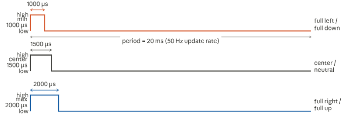

*Figure 4.14 — PWM signal timing diagram*

#### Signal parameters

For RC-style servos - the standard actuator type in small UAVs - the PWM parameters are well established:

- Pulse width range: 1000 \(\mu s\) (minimum) to 2000 \(\mu s\) (maximum)
- Center / neutral position: 1500 \(\mu s\)
- Update rate: 50 Hz for analog servos (one pulse every 20 ms), up to 400 Hz for digital servos
- Signal voltage: typically 3.3 V or 5 V logic level

A Pulse of 1000 \(\mu s\) commands the servo to one extreme of its travel. A Pulse of 2000 \(\mu s\) commands the opposite extreme, 1500 \(\mu s\) commands the neutral center position. The FCC maps its internal control output - a normalized value between -1 and +1 - to this pulse width range before sending the signal.

#### Update rate and timing

The update rate determines how frequently the FCC sends new commands to the actuator. For analog servos, 50 Hz is the standard. Digital servos can accept much higher rates, typically 200 to 400 Hz, which reduces actuator latency and improves responsiveness. The update rate must be matched to the servo type - sending high-rate commands to an analog servo can cause overheating or erratic behavior.

#### Open-loop nature of PWM

An important characteristic of PWM servo control is that open-loop from FCC's perspective. The FCC sends a position command but receives no confirmation that the servo reached the commanded position. If a servo jams, disconnects, or saturates mechanically, the FCC will not detect this directly. This makes actuator health and mechanical integrity critical assumptions in the control system design, and it is why pre-flight actuator checks are a standard item in UAV operating procedures.

### 6.2 Servo Types

Not all servos are equivalent. Three categories are relevant to UAV systems engineering:

**Analog servos** use a continuous analog feedback circuit internally. They update their position in response to each incoming PWM pulse. They are simple, inexpensive, and robust, but their resolution and response speed are limited. They are the standard choice for low-cost and expendable UAVs.

**Digital servos** use an internal microprocessor to process the PWM command and drive the motor at a much higher internal update rate - typically 300 Hz or more. This produces faster response, higher internal update rate. This produces faster response, higher holding torque, and better precision compared to analog servos. The external interface is still PWM, so they are drop-in compatible with analog servo outputs on the FCC. Digital servos consume more current, particularly at rest, which must be accounted for in the power budget.

**Brushless servos** use a brushless DC motor as the drive element instead of a conventional brushed motor. They offer significantly higher torque, faster response, and longer service life. They require a more complex driver circuit and are used primarily in larger or higher-performance UAVs where control surface loads are high. Their interface may be PWM or a digital bus protocol depending on the implementation.

### 6.3 Digital Servo Protocols - SBUS and DSM

As UAV systems grew more complex, the limitations of individual PWM signals became apparent. Each PWM channel requires a dedicated signal wire from the FCC — a system with eight control surfaces needs eight separate signal lines, each connected to a dedicated output pin on the FCC. Power and ground are shared across a common servo rail, but the signal wiring alone increases harness complexity, weight, and the number of FCC output pins consumed.

Digital servo bus protocols address this by multiplexing multiple servo channels onto a single serial data line. The FCC transmits all channel commands over one UART output to an SBUS decoder. The decoder distributes individual PWM signals to each servo locally. This reduces the FCC-to-harness connection to a single wire regardless of how many servos are present.

**SBUS** (Serial Bus), is the most widely used digital servo protocol in UAV autopilot systems. It transmits up to 16 servo channels over a single wire at 100 kHz, using an inverted UART signal. The FCC sends one SBUS frame containing all channel positions at a configurable update rate. SBUS requires a signal inverter on some hardware because the logic polarity is inverted relative to standard UART.

**DSM** (Digital Spectrum Modulation), developed by Spektrum, serves the same purpose and is encountered in systems that use Spektrum-compatible RC receivers.

*Table 4.3 — PWM and SBUS as FCC-to-actuator comparison table*

| Property | PWM | SBUS |
|---|---|---|
| Signal type | Analog pulse width | Digital serial (inverted UART) |
| Wires per channel | 1 wire per channel | 1 wire for all channels |
| Channels supported | 1 per output pin | Up to 16 channels |
| Update rate | 50 Hz (analog) — 400 Hz (digital servo) | ~70 Hz (14 ms frame) or ~140 Hz (7 ms frame) |
| Latency | Very low — direct pulse | Low — one frame period |
| Wiring complexity | High — many wires for many servos | Low — single signal wire |
| Compatibility | Universal — all servos support PWM | Moderate — requires SBUS-capable servos or decoder |
| Typical use | Simple UAVs, direct FCC to servo | Multi-surface UAVs, RC receiver to FCC link |

SBUS and DSM are serial digital protocols. The signal traveling between the FCC and the decoder — or between the RC receiver and the FCC — is a serial data stream, not PWM. No pulse widths, no timing-based encoding.

However, after the SBUS decoder, the signal going to each individual servo is still PWM — because most standard servos only understand PWM. The decoder's job is precisely to receive the digital serial stream and convert it back into individual PWM signals for each servo.

### 6.4 Servo Rail Power Considerations

Servos are not passive signal consumers - they draw significant current, particularly under aerodynamic load when control surfaces are being deflected against airflow. This has direct implications for power system design.

The servo rail is the dedicated power bus that supplies voltage to all servo outputs. It operates at 5V in most UAV systems. Key considerations for systems engineers:

- **current capacity** A UAV with multiple servos can draw several amperes on the servo rail during combined deflections. The power supply feeding this rail must be sized with adequate margin above the peak combined load.
- **electrical isolation** the servo rail should be electrically isolated or at least decoupled from the sensitive avionics power rail. Servo motors generate switching noise and back-EMF transients that can interfere with FCC logic, IMU measurements, and communication buses if they share a common power path.
- **brownout protection**  if the servo rail voltage drops below the FCC's operating threshold during high-load events, the FCC may reset mid-flight. A dedicated voltage regulator or power module for the servo rail prevents this.

- **failsafe behavior** most servo controllers hold their last commanded position if the signal is lost. The FCC must be configured to output defined failsafe pulse to each servo in the event of signal loss, commanding a safe default deflection rather than leaving servos in an undefined state.

### 6.5 System-Level Considerations

#### Actuator chain and control authority

Control authority refers to the ability of the actuators to produce sufficient aerodynamic effect to achieve the commanded motion. From the avionics perspective, this is not determined by the servo alone — it is a property of the entire chain: servo torque, mechanical linkage stiffness, control surface size, hinge geometry, and aerodynamic loading. The FCC assumes this chain is functional and within its authority limits. Its limits strongly influence control law design and safety margins. The diagram below shows this chain and the points where failure or saturation can occur.

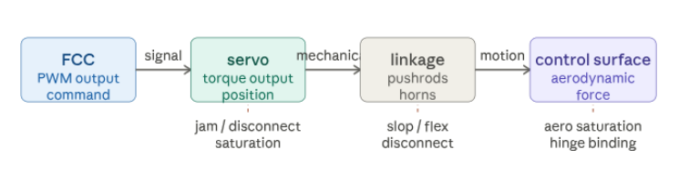

*Figure 4.15 — Actuator chain diagram*

## 7. Telemetry & External Interfaces

Telemetry and external interfaces define how the UAV communicates with systems outside itself, most notably the Ground Control Station (GCS). While sensors and actuators operate entirely onboard, telemetry provides visibility into the vehicle's state and, in some cases, allows commands to be sent from the ground.

From a systems-engineering perspective, telemetry is not part of the core flight loop. The aircraft flies, stabilizes, and navigates entirely on its own. Telemetry is an external interface layered on top of that autonomous operation - useful, but not essential to flight.

### 7.1 The Radio Link

The telemetry link connects the flight control computer to the GCS through a radio system. Both the aircraft and the GCS have a radio modem - a small device that converts digital data into radio waves for transmission and back into digital data on reception. The two modems form a bidirectional link: the aircraft transmits its state to the ground, and the ground can transmit commands back to the aircraft.

#### What is a radio modem?
 
A radio modem - sometimes called a telemetry radio or datalink radio - is a device that sends and receives digital data over a radio frequency. It connects to the FCC via a serial UART interface on one side and radiates a radio signal through an antenna on the other. Common examples used in small UAVs include the SIK radio family operating at 433 MHz or 915 MHz. The ground-side modem connects to the GCS computer, typically over USB.

Telemetry radios for small UAVs commonly operate in one of three frequency bands:
- 433 MHz - longer range, better obstacle penetration, used in regions where this band is available for unlicensed use
- 915 MHz - widely used in the Americas, good balance of range and data rate
- 2.4 GHz - shorter range, higher data rate potential, more susceptible to interference from Wi-Fi and other devices

Typical telemetry link data rates are low - on the order of 57 kbps or less for standard UAV radio modems. This is sufficient because telemetry messages are small and infrequent compared to, for example, video streaming.

### 7.2 RC Link vs GCS Datalink

A UAV system typically has two separate radio links operating simultaneously, serving different purposes. Confusing them is a common source of misunderstanding. The diagram below shows both links and their roles.

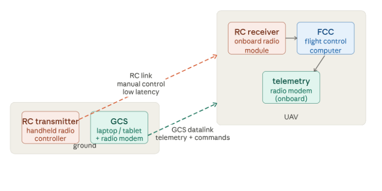

*Figure 4.16 — UAV communication links diagram*

**The RC link** carries manual control commands from the operator to the aircraft — stick positions, mode switches, and safety inputs. It is designed for very low latency, meaning the delay between the operator moving a control input and the aircraft responding must be just a few milliseconds. This is essential for safe manual flight. The RC link typically operates at 2.4 GHz or 900 MHz using protocols such as SBUS or DSM.

**The GCS datalink** connects the GCS computer to the FCC via a pair of radio modems. It carries telemetry data from the aircraft to the ground and mission commands from the ground to the aircraft. This link tolerates higher latency - hundreds of milliseconds is acceptable because it is not in the real-time control loop.

The two links are independent. Loss of the RC link does not affect the GCS datalink and vice versa. In fully autonomous missions, the RC link may not be present at all.

### 7.3 MAVLink Protocol

The GCS datalink is a radio channel - it carries raw bytes between the FCC and the GCS. A protocol is needed to give structure to those bytes, defining  what each message means, how it is formatted, and how errors are detected.

#### What is MAVLink?

MAVLink (Micro Air Vehicle Link) is a lightweight, open-source messaging protocol designed specifically for UAV communication. It defines a library of typed messages - each with a fixed structure and a unique ID - that FCC and GCS software use to exchange information. Examples include HEARTBEAT (a periodic status message confirming the system is alive), GLOBAL_POSITION_INT (current GPS position), ATTITUDE (roll, pitch,yaw estimates), COMMAND_LONG (a command from GCS to FCC such as change mode or go to waypoint), and SYS_STATUS (battery voltage, sensor health). MAVLink messages are compact - typically 8 to 263 bytes - making them efficient over low-bandwidth radio links. MAVLink is supported by virtually all open-source UAV autopilots including ArduPilot and PX4, and by GCS software such as Mission Planner and QGroundControl.

From a systems-engineering perspective, MAVLink defines the language that FCC and GCS speak to each other. As long as both sides implement the same MAVLink message definitions, any compliant FCC can communicate with any compliant GCS - regardless of manufacturer.

### 7.4 Monitoring vs Control

A key design distinction in telemetry systems is the difference between monitoring and control.

**Monitoring** means telemetry is used only to observe the system. The aircraft flies its mission autonomously and the ground station simply receives information - position, attitude, battery level, mission progress. No commands are sent that affect flight behavior.

**Control** means that commands affecting vehicle behavior - such as mode changes, waypoint updates, or termination commands - can be sent from the ground to the aircraft over the telemetry link.

In many UAV architectures, especially those intended for autonomous or expendable missions, telemetry is designed primarily for monitoring rather than control. This ensures that the loss of the telemetry link does not compromise flight safety or mission execution. The aircraft must be able to continue its mission or execute predefined failsafe behavior without any external input.

When telemetry does allow control, strict constraints are imposed. Commands from the GCS are validated, filtered, and bounded by onboard logic. This prevents erroneous or delayed commands from destabilizing the aircraft. The system is always designed so that onboard autonomy has final authority over flight behavior.

### 7.5 Latency and Bandwidth

Telemetry links operate at low data rates - typically between 9.6 kbps and 57 kbps for standard UAV radio modems. This is intentional: low data rate radios are simpler, consume less power, and achieve longer range than high-bandwidth alternatives.

Latency on a typical telemetry link is in the range of tens to hundreds of milliseconds. This is entirely acceptable because telemetry is not in the real-time control loop. Position updates arriving 200 ms late have no effect on flight stability - the FCC is already handling stabilization autonomously at 100–400 Hz using onboard sensors.

The update rate of telemetry messages is configurable in most FCC firmware. Typical rates are 1 to 10 Hz for position and attitude data, and lower rates for less time-sensitive data such as battery status or system health. Higher rates consume more radio bandwidth and may cause link congestion if set too aggressively.

### 7.6 System-Level Considerations

From a system-dependency standpoint, telemetry is treated as non-essential. The flight control computer never assumes that the GCS is available or responsive. All critical control logic, navigation, and safety handling are executed onboard. Telemetry, when present, provides situational awareness rather than authority.

In expendable systems, telemetry is often optional or deliberately limited. Reducing reliance on external communication simplifies system integration, reduces power consumption, and lowers the risk of mission failure due to link loss or interference. In some cases, telemetry is included only during development and testing and removed or disabled in operational configurations.

External interfaces may also include payload communication links, health monitoring ports, or configuration interfaces used before flight. These are similarly treated as secondary to core avionics functions. Their failure may reduce functionality or observability but should not lead to loss of control.

## 8. Interfaces & Integration

Every component in the avionics system - IMU, GNSS receiver, magnetometer, air data sensors, telemetry radio, servos - must exchange data with the flight control computer. The physical and electrical means by which this exchange happens is called an interface. Choosing the right interface for each component, and implementing it correctly, is one of the most practical challenges in avionics system integration.

This section explains the main interface types used in UAV avionics, how they work conceptually, and how they are allocated across the system.

### 8.1 What is an Interface?

Before discussing specific protocols, it is worth clarifying what an interface actually is. An interface has two parts:

- **Physical layer** - the actual wires, voltage levels, and electrical connections between two devices
- **Protocol** - the set of rules that governs how data is formatted, when each device is allowed to transmit, and how errors are detected.

Think of it like a telephone conversation. The physical layer is the telephone line and the sound waves - the medium through which communication happens. The protocol is the social convention.

In UAV avionics, the most common interface protocols are UART, SPI, I2C, and CAN. Each was designed for different purposes and has different strengths.

### 8.2 UART

#### What is UART?

UART stands for Universal Asynchronous Receiver-Transmitter. It is the simplest and oldest of the common digital interfaces, and it is used extensively in UAV systems for connecting sensors, GPS receivers, telemetry radios, and RC receivers to the FCC.

UART is a **point-to-point** interface - it connects exactly two devices directly to each other. One device transmits on a wire called TX (transmit), the other receives on a wire called RX (receive). The two wires are crossed - the TX of one device connects to the RX of the other, and vice versa.

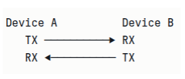

*Figure 4.17 — UART connection*

#### How does it work?

UART is asynchronous - meaning there is no shared clock signal between the two devices. Instead, both devices agree in advance on a speed, called the boud rate, measured in bits per second. Common baud rates in UAV systems are 9600, 57600, and 115200 baud. As long as both devices use the same baud rate, they can understand each other.

When a device wants to send a byte of data, it pulls the line low for one bit period - this is called the start bit, and it tells the receiver that data is coming. Then the 8 data bits follow, one by one, at the agreed rate. A stop bit at the end signals the byte is complete.

#### What is a baud rate?

Baud rate is the number of signal changes per second on a communication line, which in simple UART corresponds directly to bits per second. A baud rate of 115200 means 115,200 bits are transmitted every second. At this rate, one byte (8 bits plus start and stop bits = 10 bits total) takes approximately 87 microseconds to transmit.

#### Where is UART used in UAV avionics?

UART is the standard interface for:

- GNSS receiver ⟶ FCC (transmitting NMEA or UBX position data)
- Telemetry radio ↔ FCC (MAVLink messages in both directions)
- RC receiver ⟶ FCC (SBUS or DSM protocol)
- External companion computers ⟶ FCC

UART is simple, robust, and universally supported. Its limitation is that it is point-to-point - each UART connection requires dedicated pins on the FCC, and the FCC typically has a limited number of UART ports.

### 8.3 SPI

#### What is SPI?

SPI stands for Serial Peripheral Interface. It is a faster, synchronous interface used for high-speed, short-distance communication between the FCC and sensors that need to transfer data quickly - most notably the IMU.

Unlike UART, SPI uses a shared clock signal. The FCC generates a clock pulse, and data is transferred in synchronization with that clock. This makes SPI faster and more reliable than UART for high-rate sensor data.

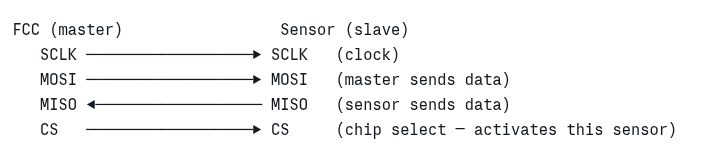

*Figure 4.18 — four wires of SPI*

#### Master and Slave

SPI uses a master-slave architecture. The FCC is always the master - it controls the clock and initiates all communication. The sensor is the slave - it only responds when the master addresses it. This means sensors cannot spontaneously send data to the FCC; the FCC must actively request it. 

The CS (Chip Select) wire allows one FCC to communicate with multiple sensors on the same SPI bus. Each sensor has its own CS line. The FCC pulls one CS line low to select that sensor, communicates with it, then releases it before selecting another.

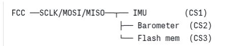

*Figure 4.19 — An example of CS wires*

#### Where is SPI used in UAV avionics?

SPI is the standard interface for:

- IMU ⟶ FCC (high update rates of 1-8 kHz require fast transfer)
- Barometric pressure sensor ⟶ FCC (on some implementations)
- Onboard flash memory ⟶ FCC (for data logging)

### 8.4 I2C

#### What is I2C?

I2C stands for Inter-Integrated Circuit. Like SPI, it is a synchronous bus - it uses a clock signal. Unlike SPI, it uses only two wires for communication with any number of devices, making it very convenient for connecting multiple low-speed sensors.

The two wires are:

- **SCL** - Serial Clock, generated by the master (FCC)
- **SDA** - Serial Data, shared bidirectional data line

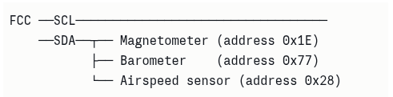

*Figure 4.20 — I2C connection*

#### Addressing

Because all devices share the same two wires, I2C uses addressing to distinguish between them. Every I2C device has a unique address - a number between 0 and 127. When the FCC wants to communicate with a specific sensor, it first broadcasts that sensor's address on the bus. Only the sensor with the matching address responds. All others ignore the message.

This is similar to calling out a name in a room full of people - only the person whose name was called responds.

#### I2C vs SPI

I2C uses fewer wires than SPI and allows many devices on the same bus, but it is slower. SPI is faster but requires more wires and a dedicated CS line per device. In practice, UAV FCCs use both - SPI for high-speed sensors like IMU, and I2C for slower sensors like magnetometer, barometer, and airspeed sensor.

*Table 4.4 — I2C and SPI comparison table*

|   | I2C | SPI |
|---|---|---|
| Wires | 2 (shared bus) | 4 + 1 per device |
| Speed | Up to ~ 400 kHz typical | Up to several MHz |
| Devices on one bus | Many (up to 127) | Multiple (one CS per device) |
| Typical use | Magnetometer, barometer, airspeed | IMU, flash memory |

### 8.5 CAN Bus

#### What is CAN?

CAN stands for Controller Area Network. It was originally developed for the automotive industry - to allow the many electronic control units in a car to communicate reliably over a single shared bus, even in the presence of electrical noise and vibration.

In UAV avionics, CAN is used when robustness and reliability matter more than simplicity. It is a two-wire differential bus - meaning the signal is encoded as the voltage difference between two wires rather than the voltage on a single wire. This makes it highly resistant to electromagnetic interference.

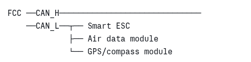

*Figure 4.21 — CAN Bus connection*

#### What is differential signal?

In a standard single-wire signal, information is encoded as the voltage level on one wire relative to ground. If electrical noise raises or lowers that voltage, the signal is corrupted. In a differential signal, two wires carry opposite versions of the same signal. Noise affects both wires equally, so the difference between them - which carries the actual information - remains clean. This is why CAN is much more noise-resistant than UART or I2C.

#### Where is CAN used in UAV avionics?

CAN is used in more capable UAV systems for:

- Smart ESCs (Electronic Speed Controllers) that report motor RPM, temperature, and current back to the FCC.
- Air data modules that perform onboard computation and deliver calibrated outputs
- GPS/compass modules in systems requiring high reliability.

In simple or expendable UAVs, CAN is often not used - UART and I2C are sufficient and simpler to implement.

#### UAVCAN / DroneCAN

UAVCAN - now renamed DroneCAN is a higher-level protocol built on top of the CAN physical layer, specifically designed for UAV avionics. Where CAN defines only how bits are transmitted electrically, DroneCAN defines what the messages mean - their structure, content, and timing. It provides a standardized set of message types for common avionics data: IMU readings, GPS position, actuator commands, battery status, and more.

From a systems-engineering perspective, DroneCAN allows avionics components from different manufacturers to communicate over a common bus using a common language, as long as all components implement the DroneCAN standard. This is the same interoperability concept we saw with MAVLink, but applied to the onboard avionics bus rather than the ground link.

### 8.6 Wiring Integrity, EMI, and Grounding

Choosing the right protocol is only part of the integration challenge. The physical installation of wiring has a significant impact on system reliability.

#### EMI - Electromagnetic Interference

EMI is unwanted electrical noise that couples into signal wires from nearby sources. In a UAV, the main sources of EMI are:

- **Motors and ESCs** - switching large currents at high frequency generates strong electromagnetic fields.
- **Power cables** - carrying high current to motors radiates noise
- **Servo motors** - brush motors generate electrical noise when commutating

This noise can corrupt data on sensitive signal buses - particularly I2C and UART - causing communication errors, sensor dropouts, or erratic FCC behavior.

Mitigation strategies:

- Route signal wires away from power cables - physically separate them where possible
- Use twisted pair wiring for CAN and other differential signals
- Keep signal wire runs as short as practical
- Use shielded cables for particularly sensitive connections

#### Grounding

All devices in the avionics system must share a common ground reference. If two devices have different ground potentials - even by a fraction of a volt - the voltage levels representing logic high and logic low become ambiguous, causing communication errors.

A clean grounding strategy means:

- All grounds connect to a single common point - called a star ground - rather than daisy-chaining from device to device
- The avionics ground is kept separate from the high-current motor ground where possible, joining only at one point

#### Connector Integrity

In the UAV environment, vibration is constant. Connectors that are not properly secured will work loose over time, causing intermittent connections that are among the most difficult faults to diagnose. Every connector in the avionics harness should be secured with a friction lock, cable tie, or adhesive as appropriate.

### 8.7 Interface Allocation Table

The table below summarizes which interface type connects each avionics component to the FCC. This is the kind of reference a systems engineer produces early in the design process to define the electrical architecture before ant hardware is selected or wiring begins.

*Table 4.5 — Avionics components interface types to the FCC*

| Component | Interface | Direction | Typical data / protocol | Update rate |
|---|---|---|---|---|
| IMU (gyro + accel) | SPI | Sensor → FCC | Raw angular rate, acceleration | 1–8 kHz |
| Barometric pressure sensor | I2C | Sensor → FCC | Raw pressure, temperature | 25–100 Hz |
| Magnetometer | I2C | Sensor → FCC | Magnetic field vector (3-axis) | 10–100 Hz |
| Differential pressure (airspeed) | I2C | Sensor → FCC | Raw differential pressure | 25–100 Hz |
| GNSS receiver | UART | Sensor → FCC | NMEA / UBX — position, velocity, time | 1–25 Hz |
| Telemetry radio | UART | Bidirectional | MAVLink messages | 1–10 Hz |
| RC receiver | UART | Receiver → FCC | SBUS / DSM control channels | 70–140 Hz |
| Servos (PWM direct) | PWM | FCC → Servo | PWM pulse 1000–2000 µs | 50–400 Hz |
| Servos (bus) | SBUS | FCC → Decoder → Servo | SBUS serial frame, 16 channels | 70–140 Hz |
| Smart ESC / ADC module | CAN | Bidirectional | DroneCAN messages | 10–100 Hz |

## 9. System Integration & Failure Considerations

System integration is the process of bringing all these components together into a single working system. This is where most practical problems appear. A component that works perfectly in isolation may behave incorrectly when installed in an aircraft alongside motors, power electronics, and other sensors.

From a systems-engineering perspective, integration is not just physical assembly. It includes verifying that every interface works as expected, that every failure mode has a defined response, and that the system behaves predictably not only in normal conditions but also when things go wrong.

### 9.1 Failure Modes

A failure mode is a specific way in which a component or link can stop working correctly. In avionics, failure modes are not just theoretical - they must be anticipated during design and handled gracefully by the system. The three most common categories in small UAV avionics are sensor loss, link loss, and power failure.

#### Sensor loss

Sensor loss occurs when a sensor stops providing valid data - due to hardware failure, connector fault, software error, or environmental conditions such as icing or interference. The consequences depend on which sensor is lost:

- **IMU loss** - the most critical failure. Without attitude information, stabilization fails. In expendable UAVs, IMU loss typically results in immediate mission termination.
- **GNSS loss** - navigation degrades. The aircraft can continue flying using inertial sensing alone for a limited period, but position accuracy deteriorates rapidly. The FCC typically switches to a timed or inertially-guided failsafe mode.
- **Air data loss** - airspeed regulation fails. The FCC falls back to GNSS groundspeed as a coarse substitute. Stall protection is lost, which is a significant safety margin reduction on fixed-wing aircraft.
- **Magnetometer loss** - heading reference degrades. GNSS course over ground substitutes during forward flight. This is generally the least critical sensor loss in terms of immediate flight safety.

#### Link loss

Link loss occurs when a communication link - RC or GCS datalink - is interrupted. The FCC must detect this condition and respond with a predefined failsafe behavior. Common failsafe responses include:

- **Continue mission** - the aircraft ignores the lost link and completes the preloaded mission autonomously. Appropriate for fully autonomous systems where GCS monitoring is secondary.
- **Return to launch** - the aircraft navigates back to the launch point. Requires GNSS to be functioning.
- **Mission termination** - in expendable systems, link loss beyond a defined timeout may trigger termination logic. This is a deliberate design choice to prevent the vehicle from flying uncontrolled into unintended areas.

#### Power failure

Power failure ranges from a gradual battery voltage drop to a sudden complete loss of power. Gradual depletion is manageable - the FCC monitors battery voltage and triggers a low-battery failsafe before critical levels are reached. Sudden power loss - caused by a connector fault, short circuit, or ESC failure - gives no warning and results in immediate loss of all avionics function.

Mitigation in expendable UAVs is primarily through design simplicity - fewer power conversion stages, short and robust wiring runs, and conservative voltage thresholds for failsafe triggering.

### 9.2 Sensor Redundancy and Health Monitoring

#### Redundancy in expendable UAVs

Redundancy means having more than one of a critical component so that if one fails, the other takes over. In manned aviation and high-value UAV systems, redundancy is standard - dual IMUs, dual power supplies, dual flight computers.

In expendable or low-cost UAVs, full redundancy is rarely implemented. The cost, weight, and complexity of duplicating every critical component is difficult to justify for a system designed for a single mission. Instead, expendable UAV design focuses on:

- **Robustness over redundancy** - selecting components with high reliability and wide operating ranges rather than duplicating them
- **Graceful degradation** - designing the system so that loss of a non-critical sensor degrades performance rather than causing immediate failure.
- **Predictable failure behavior** - ensuring that when a component does fail, the system responds in a known, safe, and planned way.

#### Health monitoring

Health monitoring is the FCC's continuous process of checking whether each sensor and interface is functioning correctly. In practice this means:

- Checking that each sensor is delivering data at its expected update rate - a sensor that goes silent has likely failed
- Checking that sensor values are within physically plausible ranges - an IMU reporting 500 degrees per second on a stationary aircraft is almost certainly faulty
- Checking that values from different sensors are mutually consistent - for example, barometric altitude and GNSS altitude should agree within a reasonable tolerance

When a health check fails, the FCC logs the fault, may alert the operator via telemetry, and applies the appropriate failsafe response for that sensor.

### 9.3 Redundancy in General UAV Systems

For completeness, it is worth briefly describing how more capable - non-expendable - UAV systems approach redundancy, since a systems engineer may encounter these architectures.

In general-purpose or high-value UAV systems, redundancy is applied systematically across critical functions.

- **Dual or triple IMUs** - multiple inertial sensors are fused together. If one produces anomalous readings, it is identified through voting - the majority reading is trusted and the outlier is rejected.
- **Dual FCCs** - a primary and a backup flight computer, with automatic switchover on primary failure.
- **Dual power supplies** - independent power paths for avionics and servos, with automatic switchover.
- **Redundant communication links** - primary and backup datalinks on different frequency bands.

#### What is sensor voting?

Sensor voting is a technique used when three or more sensors measure the same quantity. The FCC compares all readings and assumes the correct value is the one agreed upon by the majority. If one sensor gives a significantly different reading from the other two, it is flagged as faulty and removed from the estimate. This is sometimes called a two-out-of-three voting scheme.

Voting requires a minimum of three sensors to be effective - with only two sensors, a disagreement cannot be  resolved because there is no majority.

This level of redundancy adds significant cost, weight, and integration complexity. It is justified in systems that carry valuable payloads, operate over populated areas, or are required to meet formal safety standards.

### 9.4 Integration Checklist

The table below presents a structured integration checklist organized by subsystem. It represents the minimum set of verifications a systems engineer should perform before declaring an avionics system ready for flight. Each item identifies what to check, what to look for, and what failure results if the check is skipped.

*Table 4.6 — Integration checklist table*

| Subsystem | Check Item | What to verify | Failure if skipped |
|---|---|---|---|
| FCC | Firmware version confirmed | Correct firmware loaded, parameters backed up, no error flags on boot | Unexpected behavior, missing features, parameter corruption |
| FCC | Control loop outputs verified | Manual stick inputs produce correct surface deflections in correct direction | Reversed controls - immediate loss of control on takeoff |
| IMU | Attitude readout | GCS shows correct roll, pitch, yaw when aircraft is manually tilted | Inverted or incorrect attitude estimate - loss of control |
| GNSS | Antenna placement verified | Antenna has clear sky view, not shaded by airframe or carbon fiber | Poor fix quality, high DOP - navigation errors |
| GNSS | Fix quality confirmed | 3D fix acquired, HDOP below threshold, satellite count above minimum | Navigation unavailable - mission cannot proceed safely |
| GNSS | Declination configured | Magnetic declination value set correctly for operating region | Systematic heading error - aircraft flies wrong course |
| Air data | Pitot ports clear | Both pitot and static ports unobstructed, port covers removed | Blocked pitot - incorrect airspeed, stall protection loss |
| Air data | Airspeed reads correctly | Blowing into pitot port produces positive airspeed reading on GCS | Inverted airspeed sensor - throttle control failure |
| Air data | QNH / altitude reference set | Barometric altitude matches known field elevation within tolerance | Altitude error - incorrect altitude hold reference |
| Magnetometer | Placement verified | Magnetometer located away from motors, ESC, and power cables | Magnetic interference - heading errors during flight |
| Actuators | Control surface deflections correct | Each surface deflects in correct direction and correct amount for each input | Reversed surface - immediate loss of control |
| Actuators | Failsafe positions defined | Each servo commanded to safe deflection on signal loss | Undefined actuator state on link loss - unpredictable behavior |
| Power | Servo rail voltage confirmed | Servo rail reads correct voltage under load, regulator not overloaded | Brownout - FCC resets in flight |
| Power | Battery voltage monitoring active | FCC reads correct battery voltage, low-battery failsafe threshold set | Unexpected power loss without warning |
| Telemetry | GCS link confirmed | Bidirectional MAVLink communication established, RSSI acceptable | No situational awareness - operator flying blind |
| Telemetry | Failsafe on link loss configured | Aircraft executes defined behavior (continue / return / terminate) on GCS loss | Undefined behavior on link loss |

## 10. Sensor Fusion

No single sensor is complete on its own. The IMU is fast but it drifts. GNSS is accurate over time but slow and dependent on external signals. The barometer is stable but affected by weather. The magnetometer provides heading but is sensitive to interference.

Sensor fusion is the process of combining all of these imperfect measurements into a single coherent estimate of the aircraft's state - its attitude, position, velocity, and heading - that is more accurate and more reliable than any individual sensor could provide alone.

The result of sensor fusion is not a raw sensor reading. It is the flight control computer's best answer to the question: *what is the aircraft actually doing right now?*

### 10.1 Why Fusion is Needed?

The limitations of individual sensors were covered in detail in earlier sections. Brought together, the picture looks like this:

*Table 4.7 — Sensor limitations*

| Sensor| What it provides | Key limitation |
|---|---|---|
| IMU (gyro) | Fast, responsive rotation rates | Drifts over time - cannot be used alone for long-term attitude |
| IMU (accel) | Gravity reference for roll and pitch | Unreliable during maneuvering - disturbed by inertial forces | 
| GNSS | Absolute position and velocity | Slow update rate, dependent on satellite signal availability | 
| Barometer | Altitude and climb rate | Affected by weather pressure changes, not geometric height | 
| Magnetometer | Absolute heading reference | Sensitive to electromagnetic interference from onboard electronics |

No single sensor in this list can provide a complete, reliable state estimate on its own. Each one needs the others to compensate for its weaknesses. Sensor fusion is the engineering discipline that manages this compensation systematically.

### 10.2 The Complementary Filter

#### Concept

The complementary filter is the simplest and most intuitive fusion approach. It is best understood through the gyroscope and accelerometer example, since these two sensors have perfectly complementary characteristics:

- The **gyroscope** is accurate in the short term but drifts in the long term
- The **accelerometer** is noisy and unreliable in the short term but provides a stable gravity reference in the long term

The complementary filter exploits this by blending the two signals using frequency content:

- **High-frequency changes** — rapid rotations that happen over fractions of a second  — are trusted to the gyroscope, which responds instantly and accurately to fast motion

- **Low-frequency reference** — the slow, stable gravity direction averaged over time — is trusted to the accelerometer, which provides a reliable long-term correction.
  
The blending is controlled by a single parameter — commonly called alpha — that determines how much weight is given to each source. A high alpha trusts the gyroscope more; a low alpha trusts the accelerometer more. The diagram below illustrates this concept.

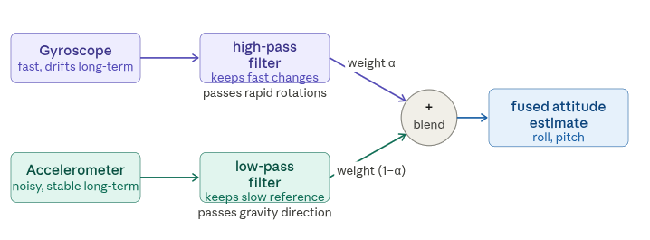

*Figure 4.22 — Complementary Filter*

#### What is a high-pass filter?

A high-pass filter is a signal processing tool that passes rapid changes and blocks slow, gradual ones. Think of it like a strainer that only lets fast fluctuations through. Applied to the gyroscope signal, it keeps the rapid rotation information while rejecting the slow drift that accumulates over time.

#### What is a low-pass filter?

A low-pass filter is the opposite - it passes slow, gradual signals and blocks rapid fluctuations. Applied to the accelerometer signal, it averages out the short-term noise and vibration, leaving only the stable long-term gravity direction.

 

The complementary filter is computationally very lightweight - it requires almost no processing power - which is why it is widely used in simple UAV systems. Its limitation is that the blending weight alpha is fixed, meaning it cannot adapt to changing conditions. If the aircraft enters a prolonged aggressive maneuver, the accelerometer becomes unreliable, but the filter keeps trusting it with the same fixed weight.

### 10.3 The Kalman Filter - Concept

#### What is a Kalman filter?

The Kalman filter is a more sophisticated estimation algorithm that addresses the main limitation of the complementary filter - its fixed, non-adaptive blending. Rather than using a fixed weight to combine sensors, the Kalman filter continuously and automatically adjusts how much it trusts each sensor based on the current situation.

It does this by maintaining two things simultaneously:

- **A state estimate** - the current best guess of the aircraft's attitude, position, velocity, and other quantities
- **An uncertainty estimate** - a measure of how confident the filter is in that state estimate at any given moment

When a sensor measurement arrives, the Kalman filter compares it to what it predicted the measurement would be. If the filter is highly uncertain about its current estimate, it trusts the new measurement more and updates aggressively. If the filter is already confident, it trusts its own prediction more and updates conservatively. This automatic, situation-dependent weighting is what makes the Kalman filter more powerful than the complementary filter.

A useful analogy: imagine you are navigating a city. If you have been walking confidently for one minute from a known starting point, you are fairly sure of your location - you trust your own dead reckoning. But if you have been walking for an hour through unfamiliar streets, your uncertainty has grown - so when you spot a landmark you recognize, you immediately update your position estimate heavily based on that new information. The Kalman filter behaves exactly this way.

#### The predict-update cycle

The Kalman filter operates in a continuous two-step cycle:

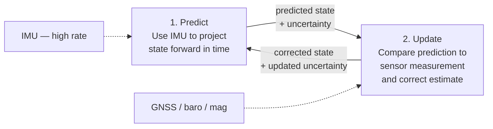
*Figure 4.23 — Two-step cycle of the Kalman Filter*

**Predict step** - using the IMU, which updates at high rate, the filter projects the current state estimate forward in time. Between external sensor updates, the filter relies on this prediction to maintain a continuous state estimate. The uncertainty of the estimate grows slightly with each prediction step - reflecting the fact that IMU integration accumulates small errors.

**Update step** - when a measurement arrives from a slower external sensor - GNSS, barometer, or magnetometer - the filter compares the measurement to its prediction. The difference between the two is called the innovation. The filter uses this difference, weighted by both the sensor's known noise level and its own current uncertainty, to correct the state estimate. After the update, uncertainty decreases.

This cycle runs continuously - predicting at IMU rate (hundreds of Hz) and updating whenever external sensor data arrives (at their respective lower rates).

#### The Extended Kalman Filter (EKF)

The basic Kalman filter works perfectly for linear systems. Aircraft dynamics are nonlinear - the relationship between, for example, attitude angles and sensor readings involves trigonometric functions that are not linear.

The Extended Kalman Filter (EKF) is a practical adaptation of the Kalman filter for nonlinear systems. It handles nonlinearity by linearizing the system equations at each step - approximating the curved relationships with straight lines locally, around the current state estimate. This approximation is valid as long as the nonlinearities are not too severe, which is the case for most normal flight conditions.

The EKF is the standard fusion algorithm used in virtually all UAV autopilots today - including ArduPilot and PX4.

### 10.4 Fusion of All Sensors

In a complete UAV avionics system, the EKF fuses data from all available sensors simultaneously. Each sensor contributes to a specific part of the state estimate: 

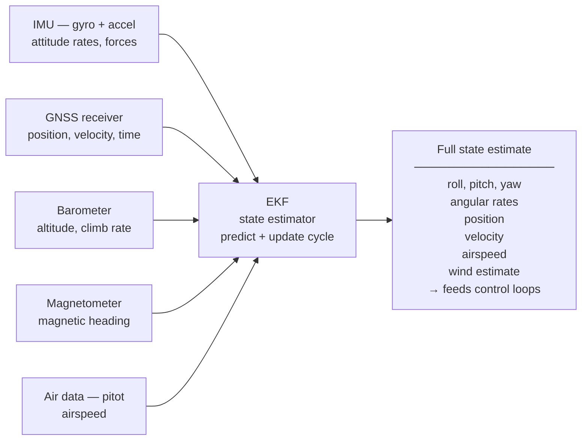
*Figure 4.24 — EKF fusion data from all available sensors*

### 10.5 Observability and Filter Tuning

#### Observability

Observability is a concept that describes whether the filter has enough sensor information to estimate a particular quantity. If a quantity is not observable - meaning no sensor provides information about it, even indirectly - the filter cannot estimate it reliably, and its uncertainty for that quantity will grow without bound.

A practical example: yaw angle is not directly observable from the accelerometers alone. If the magnetometer is absent and the aircraft is stationary, the EKF has no way to determine which direction the nose is pointing. Yaw becomes unobservable. In forward flight, GNSS course over ground restores partial observability of yaw - but only while the aircraft is moving. This is why the magnetometer matters most during stationary operation and slow flight.

#### Filter tuning

Every EKF has tuning parameters that tell it how much to trust each sensor relative to the filter's own predictions. These are called noise parameters:

- **Process noise** - how much uncertainty to add at each predict step. Higher process noise means the filter trusts sensor measurements more and its own predictions less.
- **Measurement noise** - how noisy each sensor is assumed to be. Higher measurement noise means the filter trusts that sensor less during the update step.

Setting these parameters correctly is called filter tuning. Poor tuning produces an estimator that is either too sluggish - slow to respond to real motion - or too twitchy - reacting excessively to sensor noise. In practice, filter tuning is done empirically using flight log data, comparing the filter's state estimates to known reference values.

