# Chapter 5 — Electrical Power System

---

## 1. Overview

A UAV carries several subsystems that do very different things. The propulsion system generates thrust. The avionics compute and command. The sensors observe the environment. The payload serves the mission.

The Electrical Power System does none of these things. Its role is simpler — and more fundamental: it keeps everything else running.

More precisely, the EPS is responsible for three functions:

- **Storing** electrical energy onboard (battery)
- **Conditioning** that energy into voltage levels each subsystem can use (regulation)
- **Distributing** it safely and reliably to all consumers (wiring, connectors, distribution board)

That is the full scope of the EPS. It does not decide what the aircraft does, it does not navigate, and it has no mission function of its own. In systems engineering terms, this makes EPS an *enabling subsystem* — one that exists to support all other subsystems rather than to perform a mission task directly.

#### Why "Enabling" Does Not Mean "Less Important"

The enabling role might suggest the EPS is secondary. In practice, it is the opposite.

Every active subsystem on a UAV depends on electrical power. If the EPS fails — even briefly — the consequences propagate immediately and system-wide:

- A voltage drop below threshold resets the flight controller. The UAV loses control for a fraction of a second. At low altitude, the UAV could crash.
- An ESC losing power stops the motor. There is no recovery without propulsion.
- A poorly designed power system can also introduce sensor noise, which causes navigation degradation.

This is why EPS is described as *mission-critical* even though it has no mission function. It is not the subsystem that does the mission — it is the subsystem without which no mission is possible.

One practical consequence: in system architecture diagrams, power flows are always drawn explicitly, even at the highest level of abstraction. Power is never assumed to "just be there."

### 1.1 System Boundary

Before analyzing or designing any subsystem, its boundary must be defined — that is, what is inside the system and what is outside.

For the EPS:

**Inside the system boundary:**
- Battery
- Power distribution board (PDB)
- Voltage regulators
- Internal wiring and connectors

**Outside the system boundary:**
- External battery charger
- Ground power supply
- Maintenance and test equipment

This distinction matters more than it may seem. Items inside the boundary are designed, tested, and controlled as part of the EPS. Items outside the boundary interact with the EPS through defined interfaces — but they are not part of it. When something goes wrong at that boundary, it must be clear which side is responsible.

### 1.2 Interfaces With Other Subsystems

At system level, the EPS touches almost every other subsystem. Table 5.1 gives a first-pass view of these interfaces.

**Table 5.1 — EPS interfaces at system level**

| Subsystem | Nature of interface |
|---|---|
| Propulsion (ESC / motor) | High-current, unregulated power delivery |
| Avionics (flight controller) | Regulated, stable low-voltage power |
| Actuators (servos) | Medium-current, regulated power |
| Sensors | Low-noise, tightly regulated power |
| Payload | Payload-specific power (varies by mission) |
| Structure | Physical routing, mounting, and thermal path |

At this stage, the table captures only the *existence* and *nature* of each interface — not connector pinouts, wire gauges, or signal protocols. Those details belong to the interface definitions developed later in the design process.

### 1.3 Internal Structure — A First Look

It is useful to see how the EPS itself is organized internally before diving into each element in the sections that follow.

The EPS can be read as a chain:

```
 Battery  →  Power Distribution  →  Voltage Regulators  →  Loads
 (stores)    (routes and splits)      (conditions)        (consume)
```

Each stage has a distinct responsibility. The battery stores energy but does not regulate it. The distribution board routes power but does not condition it. The regulators condition voltage but do not store or route. This separation of responsibilities makes the system easier to analyze, test, and troubleshoot — a principle that applies well beyond power systems.

The sections that follow examine each stage in turn.

---

## 2. Battery Types

The battery is the only onboard energy source. This makes the battery one of the most consequential design decisions in a UAV project. The battery determines:

- How long the UAV can fly (endurance)
- How much current it can deliver to motors and servos (performance)
- What voltage the rest of the system sees — and how that voltage behaves under load
- Which failure modes the system must be designed to tolerate

Two battery types dominate UAV applications: **Lithium Polymer (LiPo)** and **Lithium-Ion (Li-ion)**. Understanding the difference between them is not a matter of chemistry — it is a matter of knowing which system characteristics each one drives.

### 2.1 Voltage Is Not Constant

Before comparing the two types, there is one fundamental property that applies to both and that every systems engineer must internalize:

**Battery voltage is not constant. It is unregulated.**

It varies with state of charge — as the battery depletes, terminal voltage falls. It varies with load current — under a sudden current demand, voltage dips transiently. It varies with temperature — cold batteries deliver less voltage at the same state of charge.

This means that raw battery voltage cannot be fed directly to any subsystem that requires a stable supply. A flight controller, a sensor, or a servo cannot simply be connected to the battery and expected to behave correctly across the full range of operating conditions. Voltage regulation — covered in Section 4 — exists precisely because of this property.

A UAV battery is built from individual cells connected in series. Each cell has a nominal voltage of approximately 3.7 V. The total pack voltage is therefore determined by cell count, commonly referred to as the S-rating:

- 4S pack: 4 × 3.7 V = 14.8 V nominal
- 6S pack: 6 × 3.7 V = 22.2 V nominal

These are nominal values. A fully charged 4S pack sits closer to 16.8 V; a depleted one may be around 13.2 V. The downstream EPS must be designed to handle this entire range, not just the nominal value.

### 2.2 LiPo — High Power, High Demand

LiPo batteries are the most widely used type in UAV propulsion systems. Their defining characteristic is the ability to deliver very high currents relative to their size and weight.

To understand how well a battery can serve a high-power application, two numbers matter: capacity and discharge rate.

Capacity is measured in milliampere-hours (mAh). A 5000 mAh battery can deliver 5 A for one hour, or 10 A for half an hour — the total charge it can supply is fixed, but the rate at which it is drawn varies with the load.

Discharge rate is expressed as a C-rate. It is a multiplier applied to the capacity figure. A battery rated at 30C can deliver 30 times its capacity as current: for a 5000 mAh pack, that is 30 × 5 A = 150 A. This is the peak current the pack can safely supply — a level that a motor and ESC can demand during aggressive maneuvers or full-throttle climbs.

Note that C-rate and S-rating are completely independent. The S-rating defines the pack voltage (4S = 14.8 V). The C-rate defines the maximum discharge current. A 4S 5000 mAh 30C pack has all three characteristics defined separately, and they must each be checked against the system requirements.

From a systems engineering perspective, LiPo is well suited to applications where the design is power-driven: the mission requires high thrust, fast response, or heavy payloads that demand large instantaneous currents.

The trade-off is that LiPo requires careful operational discipline. It is sensitive to over-discharge — if cell voltage drops below a minimum threshold, the pack can be permanently damaged or rendered unsafe. It is also sensitive to over-current and physical damage, both of which can lead to thermal runaway, a failure mode discussed in Section 2.4.

### 2.3 Li-ion — High Energy, Lower Peak Power

Li-ion batteries store more energy per unit mass than LiPo — a higher Wh/kg figure. For a given battery weight, a Li-ion pack carries more total energy and therefore supports longer flight times.

The trade-off is peak current capability. Li-ion cells have lower maximum discharge rates than LiPo. They are less suited to applications where the motor demands large transient currents frequently.

From a systems engineering perspective, Li-ion is well suited to applications where the design is **endurance-driven**: the mission prioritizes time on station over peak performance. Long-range fixed-wing UAVs and high-altitude platforms are typical examples. In these configurations, propulsion loads are relatively steady and modest, and the endurance benefit of Li-ion outweighs its lower peak current capability.

Li-ion is also commonly used as a secondary power source — supplying avionics only, independent of the propulsion battery. This is an architecture decision that improves isolation between the high-current propulsion domain and the sensitive avionics domain.

### 2.4 Battery as a Risk Driver

The battery is not only an energy source — it is also one of the primary risk drivers in the EPS. A systems engineer must account for its failure modes during architecture design, not as an afterthought.

**Over-discharge** occurs when cell voltage falls below its minimum operating threshold. The immediate consequence is a voltage drop that can cause avionics brown-out or complete shutdown. The longer-term consequence is irreversible damage to the cell. Over-discharge is managed through voltage monitoring in the avionics and low-battery failsafe logic — not through anything in the battery itself.

**Over-current** occurs when the load demands more current than the pack is rated to deliver. Sustained over-current causes resistive heating in the pack, connectors, and wiring. In severe cases, it leads to connector failure or fire. Over-current is managed through correct wire and connector sizing, and through current monitoring.

**Thermal runaway** is the most serious failure mode. It can be triggered by physical damage, a manufacturing defect, sustained over-current, or over-charging. Once initiated, it is self-sustaining and very difficult to arrest. The consequence is fire or explosion. At system level, thermal runaway is addressed through physical containment, safe mounting practices, and — where the architecture permits — isolation of the battery from other critical components.

An important distinction: the battery itself has no intelligence. It does not monitor its own state. It does not protect itself. All monitoring and protective logic resides in the avionics or in dedicated battery management hardware. This is a systems engineering responsibility, not a component feature.

### 2.5 Choosing Between LiPo and Li-ion

The selection is not a matter of which type is better in absolute terms. It is a matter of which type is better matched to the mission profile.

**Table 5.2 — Choosing between LiPo and Li-ion**
| Design driver | Preferred type |
|---|---|
| High thrust, aggressive maneuvers, heavy payload | LiPo |
| Long endurance, steady cruise, light payload | Li-ion |
| Avionics-only secondary power supply | Li-ion |

In practice, the decision is made early in the design process, because battery selection influences voltage rail levels, regulator sizing, connector ratings, and wire gauges throughout the rest of the EPS. Changing battery type late in the design is disruptive.

The discussion above is weighted toward electric UAVs, where the battery is also the propulsion energy source and therefore dominates the EPS design. In combustion-powered UAVs, the battery serves only the avionics, servos, and sensors. In that case, the battery is much smaller, current demands are significantly lower, and C-rate matters during engine start — the starter motor demands a short but significant current spike — but once the engine is running, the discharge rate requirement drops to a modest level determined by avionics and servo loads.

The selection logic still applies, but it simplifies considerably: Li-ion is almost always the right choice, and capacity is sized against avionics endurance rather than propulsion load.

### 2.6 A Note on Redundancy

Simple UAV architectures use a single battery. If it fails, the mission ends — and depending on the failure mode, the aircraft may be lost. For many applications this is acceptable, provided the battery is correctly sized and monitored.
Where higher reliability is required, two approaches are common. The first is a dedicated secondary battery for avionics only. The second is parallel batteries with isolation diodes, which increases total capacity and provides some protection against single-cell failures.

The redundancy argument, however, differs between platform types. In an electric UAV, propulsion and avionics share the same energy source, so a single battery failure can cause simultaneous loss of thrust and flight control. The consequences are immediate and severe, which makes the case for a secondary avionics battery particularly strong. In a combustion UAV, the engine continues running on fuel regardless of battery state, so a battery failure threatens control but not propulsion. The urgency is lower, but the case for avionics redundancy remains valid.

Both approaches add weight, complexity, and cost. The decision is an architecture trade-off, driven by the consequences of power loss in the specific operational context.

---

## 3. Power distribution board (PDB)

Once energy leaves the battery, it needs to reach every subsystem. The Power Distribution Board (PDB) is the component responsible for making that happen. It accepts raw battery power at its input and splits it into multiple branches, each feeding a different part of the system.

What the PDB does and does not do is worth stating clearly, because it is easy to assign it responsibilities it does not have:

- It **routes and splits** power — this is its primary function
- It **does not** regulate voltage — that is the regulator's job
- It **does not** make control decisions — it has no intelligence
- It **does not** generate energy — it only distributes what the battery provides

In systems engineering terms, the PDB is treated as a black box with defined inputs and outputs. Its internal layout — trace widths, connector placement, fuse ratings — is an implementation detail. At architecture level, what matters is what goes in, what comes out, and what interfaces it presents.

### 3.1 The Power Tree

A useful way to represent power distribution is the **power tree** — a diagram showing how electrical energy flows from its source to all consumers. It is not a data-flow diagram and not a schematic. It is a system-level view of power routing.

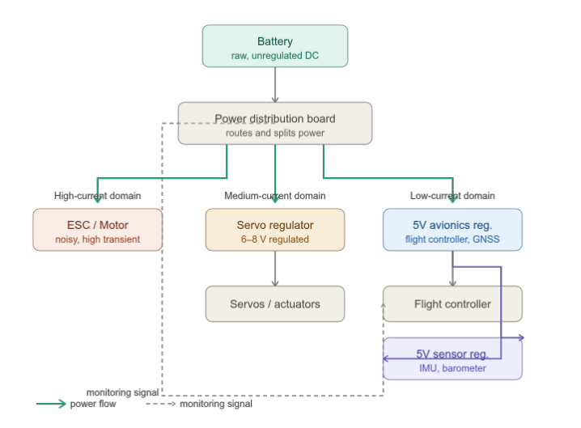
*Figure 5.1 — UAV power tree diagram*

Reading the power tree from top to bottom: the battery feeds the PDB, which splits power into branches directed at different subsystems. Some branches go directly to high-current loads. Others go first through a voltage regulator before reaching the load. The monitoring signal — battery voltage and current data — flows separately to the flight controller.

This separation between power flow and monitoring signal is deliberate and important, and it is discussed further in Section 3.3.

### 3.2 Power Domain Separation

Not all subsystems place the same demands on the power network. Motors and ESCs draw large, fluctuating currents and generate significant electrical noise. Servos draw moderate currents in bursts. Avionics and sensors draw small, steady currents but are highly sensitive to voltage variation and noise.

If these loads share a single power path, the noisy, high-current loads disturb the sensitive ones. The result is sensor measurement errors, voltage sags that reset the flight controller, and instability that is genuinely difficult to trace back to its root cause.

The solution is **power domain separation** — routing different classes of load through separate branches of the distribution network, so that disturbances in one domain cannot propagate into another.

Three domains are typically defined:

**Table 5.3 — Power domain separation**
| Domain | Consumers | Key characteristics |
|---|---|---|
| High-current | ESC, motor | Large transient currents, electrically noisy |
| Medium-current | Servos, actuators | Moderate transient currents, tolerant of some noise |
| Low-current | Flight controller, sensors, GNSS | Small steady currents, sensitive to noise and voltage variation |

Domain separation is not merely a convenience — it is a safety measure. A motor stall that creates a large current spike in the high-current domain must not be able to cause the flight controller to reset. Getting the domains right at architecture level prevents this class of failure at the root.

### 3.3 Monitoring — Observing Without Controlling

Many PDBs or power modules integrate current and voltage sensing. This data is passed to the flight controller as a monitoring signal — a separate interface from the power path itself.

This distinction carries an important systems engineering principle: **measurement is not control**.

The flight controller observes the power state — battery voltage, total current draw — and uses this information to:

- Issue low-battery warnings to the operator
- Trigger return-to-home or landing failsafe when voltage falls below a threshold
- Log power consumption data for post-flight analysis

What the flight controller does not do is actively control the distribution hardware. It cannot command the PDB to reroute power or disconnect a branch. It reacts to what it observes, but the power hardware operates independently of those reactions.

This separation also means that if the monitoring interface fails, the power system continues to function — it simply does so without the avionics being aware of its state. That is an acceptable degraded mode. The reverse would not be: a power system that depends on avionics commands to operate would fail the moment the flight controller encountered a problem.

### 3.4 PDB Interfaces

At system level, the PDB has the following interfaces:

**Table 5.4 — PDB interfaces**
| Interface partner | Interface type |
|---|---|
| Battery | High-current electrical input |
| ESC (one per motor) | High-current electrical output |
| Voltage regulators | Electrical output (raw, unregulated) |
| Flight controller | Monitoring signal (voltage and current data) |
| Structure | Mechanical mounting |

The structural interface deserves a mention. The PDB must be mounted somewhere in the airframe, and its location affects cable routing, thermal environment, and accessibility for maintenance. These are not electrical considerations, but they influence the system design.

---


## 4. Voltage Regulation

The battery delivers raw, unregulated voltage that fluctuates with state of charge, load current, and temperature. Most subsystems cannot tolerate this variability. A flight controller that expects 5 V will behave incorrectly — or reset entirely — if the supply voltage drifts by even a few hundred millivolts. Voltage regulation solves this: it takes a variable input and produces a stable, predictable output that subsystems can safely consume.


### 4.1 Power Rails

The concept of a **power rail** is fundamental to understanding how voltage regulation is organized at system level. A rail is a named, shared voltage domain distributed to one or more loads. Rather than thinking about individual wires connecting individual components, the systems engineer thinks in terms of rails — each one defined by its voltage, its tolerance, its current capacity, and which subsystems it feeds.

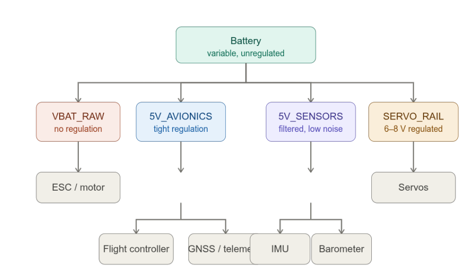
*Figure 5.2 — Power rails and their consumers*

A typical UAV uses four rails:

**VBAT_RAW** is the raw battery voltage, distributed without any regulation. Only loads that can tolerate a wide voltage range — and that generate significant noise themselves — connect to this rail. In practice, this means ESCs and motors.

**5V_AVIONICS** is a tightly regulated 5 V rail feeding the flight controller, GNSS receiver, and telemetry system. These are digital devices with narrow operating voltage ranges. A regulated rail ensures they receive stable power regardless of what the battery is doing.

**5V_SENSORS** is also regulated to 5 V, but with additional filtering to suppress electrical noise. Sensors interpret voltage fluctuations as physical measurements — noise on the supply rail appears in the sensor output as measurement error. A separate, filtered rail eliminates this problem.

**SERVO_RAIL** supplies servos and actuators at 6–8.4 V, depending on the servo specification. Servos draw medium currents with significant transients when changing position. They need regulation — but not to the same tolerance as avionics or sensors.

At architecture level, the decision to define these rails is made before any component is selected. The rails define the requirements that regulators, wiring, and connectors must satisfy.

### 4.2 Rail Separation

Having separate rails for avionics and sensors may seem redundant — both run at 5 V. The reason for separating them is noise isolation.

Sensors convert physical quantities — acceleration, pressure, temperature — into electrical signals and they need electricity for their operation. This makes them inherently sensitive to their electrical environment: any noise on the supply rail appears directly in the measurement output. An IMU powered from a noisy rail will report vibrations that do not exist. Because of this, the sensor rail must be tightly regulated and heavily filtered. Low noise in this context means a supply that holds its voltage steadily, with minimal ripple or transient disturbance.
The avionics rail, by contrast, is more tolerant. A flight controller is a digital device — its processor operates correctly as long as the supply stays within its operating range. Small fluctuations do not corrupt computation the way they corrupt a sensor reading.

Servo rails are a separate domain entirely, but worth noting here: servos draw highly transient currents and each movement generates a surge that disturbs the supply. This is precisely why the servo rail must be kept physically and electrically separate from the sensor rail — any coupling between the two would inject exactly the kind of noise that sensors cannot tolerate.

### 4.3 Brown-Out

Brown-out is one of the most important failure modes in UAV power systems, and one of the most frequently misdiagnosed. When it occurs, the UAV behaves erratically or loses control momentarily — symptoms that are easy to attribute to firmware, sensors, or pilot error. The actual cause is a power rail that collapsed below its operating threshold.

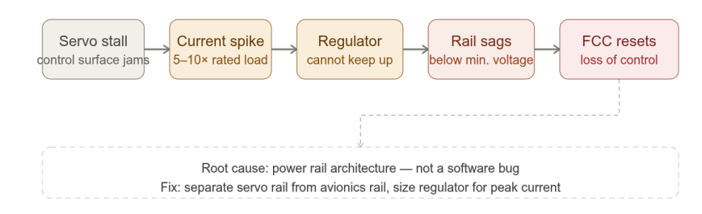
*Figure 5.3 — Brown-out chain of events*

The sequence is straightforward. A servo stalls — perhaps a control surface hits a mechanical stop or encounters high aerodynamic load. The stalled motor draws several times its rated current. If this surge flows through the same regulator that powers the flight controller, the regulator struggles to maintain its output voltage. The rail sags. If it drops below the flight controller's minimum operating voltage, the processor resets. Control is lost for a fraction of a second — which, at low altitude or in a critical phase of flight, is enough to lose the aircraft.

This is not a software bug. The firmware did not crash — it was cut off from its power supply. The fix is architectural: separate the servo rail from the avionics rail, and size each regulator for the peak current demand of its specific loads.

Understanding brown-out is particularly important because it is a failure that reveals itself only under specific load conditions. A system that passes bench testing may experience brown-out in flight during an aggressive maneuver, when servo loads are highest.

### 4.4 Voltage Regulators

Voltage regulators are present on every rail except the raw battery rail feeding the ESC and motor. Their role is to step down the battery voltage to the level each rail requires. The regulator steps down the variable battery voltage to the stable level that each rail requires. Without them, every subsystem would see the full variability of the battery — fluctuating with state of charge, load, and temperature. The regulator is what makes a defined power rail possible.

Two fundamental regulator types are used in UAV power systems, each with a different operating principle and a different set of trade-offs.

#### 4.4.1 Linear Regulator

A linear regulator places a controllable transistor — called a pass transistor — in series between the input and the output. The transistor continuously adjusts its internal resistance to maintain a constant output voltage. Whatever voltage difference exists between input and output is dropped across the transistor, and this excess energy is dissipated entirely as heat.

The efficiency consequence is direct. If the input is 14 V and the regulated output is 5 V, the transistor must absorb 9 V. At a load current of 1 A, that is 9 W of heat generated for every 5 W delivered to the load — an efficiency of approximately 36%. The larger the voltage difference between input and output, the worse the efficiency becomes.

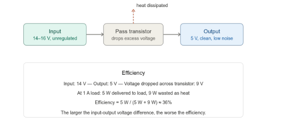

*Figure 5.4 — Linear regulator*

Despite this limitation, linear regulators have important advantages:

- The output is very clean — the regulation process introduces no electrical noise
- The design is simple and inherently reliable
- Transient response is fast — the output recovers quickly from sudden load changes

These properties make linear regulators well suited for noise-sensitive loads, particularly the sensor rail, where output cleanliness matters more than efficiency.

#### 4.4.2 Switching Regulator (Buck Converter)

A switching regulator works on a fundamentally different principle. Rather than continuously dropping excess voltage as heat, it rapidly switches the input on and off — typically at frequencies between tens of thousands and several hundred thousand cycles per second. An inductor and capacitor at the output smooth this pulsed energy into a steady DC voltage.

The output voltage is controlled by the duty cycle — the ratio of the time the switch is on to the total switching period. A higher duty cycle delivers more energy per cycle and raises the output voltage; a lower duty cycle reduces it. The regulator continuously adjusts the duty cycle to maintain the target output voltage regardless of input variation or load changes.

Because energy is transferred in controlled pulses rather than being dropped across a resistive element, very little is wasted as heat. Efficiencies of 85–92% are typical. For high-current rails — such as the servo rail or the main avionics supply — this efficiency advantage directly translates to less heat, smaller components, and longer flight time on a given battery.

Because energy is transferred in controlled pulses rather than being dropped across a resistive element, very little is wasted as heat. Efficiencies of 85–92% are typical. For high-current rails — such as the servo rail or the main avionics supply — this efficiency advantage directly translates to less heat, smaller components, and longer flight time on a given battery.

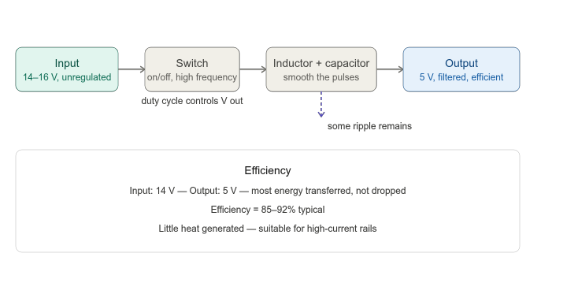

*Figure 5.5 — Switching regulator*

A switching regulator works on a fundamentally different principle. Rather than continuously dropping excess voltage as heat, it rapidly switches the input on and off — typically at frequencies between tens of thousands and several hundred thousand cycles per second. An inductor and capacitor at the output smooth this pulsed energy into a steady DC voltage.

The trade-off is switching noise. The rapid on-off switching generates electrical interference that appears as small voltage ripple on the output. This ripple is reduced by the output filter but not entirely eliminated. For analog sensors, this residual noise is unacceptable — which is why switching regulators are not used as the final supply stage for sensitive measurement circuits.

#### 4.4.3 Which to Use and When

The choice between linear and switching regulation follows from the load requirements:

**Table 5.5 — Choosing regulators**
| Load | Preferred type | Reason |
|---|---|---|
| Flight controller, GNSS, telemetry | Switching | High current, efficiency matters |
| IMU, barometer, analog sensors | Linear | Noise-sensitive, low current |
| Servo rail | Switching | High and transient current demand |
| Low-power reference circuits | Linear | Simple, clean output |

A common architecture combines both types: a switching regulator produces the main rails efficiently, and a small linear regulator provides the final clean output for the sensor rail. This approach captures the efficiency of switching regulation while preserving the low-noise output that sensors require.

### 4.5 Protection

Modern voltage regulator Integrated Circuits incorporate most protection functions internally. As a systems engineer, the responsibility is not to design these circuits from scratch — it is to verify that the selected regulator includes the protections the application requires.

**Overcurrent protection** is present in virtually all modern regulator ICs. If the load draws more current than the regulator can safely supply, the IC reduces or folds back its output rather than failing. This is the most common protection requirement and is rarely a concern with modern components.

**Thermal shutdown** is also standard in most ICs. If the junction temperature exceeds a safe limit, the regulator disables its output until it cools down. This acts as a last line of defence against sustained overload or inadequate thermal design.

**Overvoltage protection** is less universally built-in. Where it is not included in the IC, a small TVS diode across the input is sufficient. This is a single, inexpensive component — not a separate protection circuit.

**Reverse polarity** protection guards against a battery being connected with reversed polarity during maintenance. A single Schottky diode in series with the input is the standard solution.

The key point is that protection in a well-designed EPS is mostly a matter of component selection, not additional hardware. Checking the datasheet of the chosen regulator IC against the protection requirements of each rail is a standard step in detailed design.

---

## 5. Wiring Harnesses

A wiring harness is the organized set of conductors that physically connects all EPS components. It carries current from the battery through the PDB, through the regulators, and to every load on the aircraft. In practice, the harness is one of the most common sources of EPS problems — not because the underlying concepts are complicated, but because it is easy to underestimate.

From a systems engineering standpoint, a harness must satisfy two independent requirements: it must carry the required current without overheating, and it must not drop so much voltage along the way that the load sees a supply outside its operating range. Both must be checked for every circuit.


### 5.1 Wire Sizing — Two Criteria

Every wire has a conductor — typically copper — surrounded by insulation. The conductor's cross-sectional area determines its resistance. A thicker conductor has lower resistance, can carry more current, and drops less voltage. Wire gauge selection is always a balance between these two criteria (wire gauge is a measurement of wire diameter. This determines the amount of electric current the wire can safely carry, as well as its electrical resistance and weight).

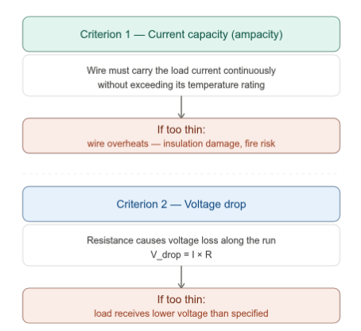

*Figure 5.6 — Wire sizing criteria*


#### Criterion 1 — Current Capacity (Ampacity)

When current flows through a conductor, it generates heat — proportional to the square of the current and the resistance of the wire. If the wire is too thin for its load, it heats up. In a UAV, a wire that reaches high temperature inside a harness bundle is a serious problem: it degrades insulation, creates a fire risk, and can cause an open circuit failure.

\[\dot{Q}_{generated} = I^{2} \cdot R_{wire}\]

Every wire has a current rating — the maximum continuous current it can carry while staying within its temperature limit. This rating depends on both the conductor cross-section and the insulation material's temperature tolerance. The wire selected for each circuit must have a current rating that exceeds the worst-case load current, with a margin.

#### Criterion 2 — Voltage Drop

All conductors have resistance. When current flows, there is a voltage drop across every wire run:

\[V_{drop} = I \cdot R_{wire}\]

where R depends on the conductor's resistivity, its length, and its cross-sectional area. For a round-trip circuit (current out and back), the total length is twice the one-way run.

For a 28 V system, a drop of 1–2 V might be acceptable. For a 5 V avionics rail, even a 0.2 V drop is 4% of the supply — potentially outside the regulator's output tolerance. Long wire runs and high currents make this worse. The systems engineer must define a voltage drop budget for each rail and verify that the wiring stays within it.

**The two criteria do not always point to the same answer.** A short, high-current wire might pass the voltage drop check with a thin gauge but fail the current capacity check. A long, low-current wire might pass the current capacity check but fail the voltage drop check. Both must be evaluated independently, and the larger (thicker) gauge selected.

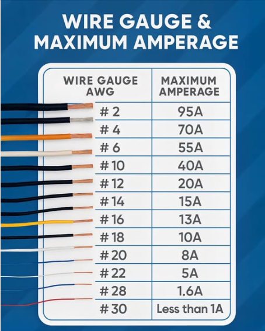

*Figure 5.7 — Wire sizing criteria*


### 5.2 Wire Gauge Standards — AWG

Wire gauge in aviation is most commonly specified using the AWG (American Wire Gauge) system. The numbering is counterintuitive: a lower AWG number means a thicker wire with a larger cross-section and lower resistance.

**Table 5.6 — Typical wire gauge ratings and useage**
| AWG | Cross-section (mm²) | Typical current rating | Common use |
|---|---|---|---|
| 22 | 0.33 | ~3 A | Signal wires, low-power sensors |
| 20 | 0.52 | ~5 A | Low-current control lines |
| 18 | 0.82 | ~10 A | Servo power, small regulators |
| 16 | 1.31 | ~13 A | Medium-current distribution |
| 14 | 2.08 | ~17 A | Main avionics supply |
| 12 | 3.31 | ~24 A | High-current distribution |
| 10 | 5.26 | ~33 A | Battery leads, motor power |

Current ratings vary with insulation type and installation conditions — the values above are indicative. Always verify against the specific wire specification for the application. The values in Figure 5.7 are slightly different from the ones in the Table 5.6 because current ratings are not a single fixed value. They depend on:

- Insulation material and its temperature rating
- Whether the wire is in open air or bundled with other wires
- Ambient temperature
- Whether the current is continuous or intermittent

One thing worth noting: these current ratings assume the wire is installed in open air with good ventilation. In a tightly bundled harness, the ratings must be derated — typically by 20–40% — because wires in a bundle cannot dissipate heat as easily as a single wire in free air. This is a common mistake in practice.

### 5.3 Routing and Installation

Wire routing is not purely an electrical decision. A harness that is electrically correct but poorly routed will fail in service. The following principles apply to all UAV harness installations.

**Route away from heat sources.** Wires routed near exhaust systems, high-current components, or other heat sources experience elevated ambient temperature. This reduces the wire's effective current rating and accelerates insulation degradation.

**Protect from sharp edges and moving parts.** The most common wire failure in service is chafing — the insulation wears through at a point of contact with a structural edge or a moving surface. Every wire that passes through a bulkhead, along a frame rail, or near a control linkage must be protected with a grommet, conduit, or appropriate strain relief.

**Avoid sharp bends, especially at connectors.** Wires that are bent sharply at the point where they enter a connector are under constant mechanical stress. Over time, this causes fatigue cracking of the conductor — often at the last strand inside the insulation, invisible from outside. The correct practice is to provide a smooth radius and a back-shell or clamp that prevents the bend from forming.

**Separate power and signal runs physically.** High-current wires generate magnetic fields that induce noise in adjacent signal conductors. The longer the parallel run and the smaller the separation, the more noise is coupled. As a general rule, power and signal harnesses should not share a conduit or be bundled together unless specific shielding measures are in place.

**Secure the harness at regular intervals.** An unsecured harness moves under vibration, which causes wear at every contact point. Clamps, tie-wraps, and adhesive mounts are used to secure bundles to the airframe at intervals appropriate to the vibration environment.


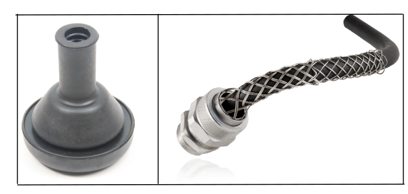

*Figure 5.8 — Wire harness grommet bulkhead and wire strain relief backshell*

### 5.4 EMI and Shielding

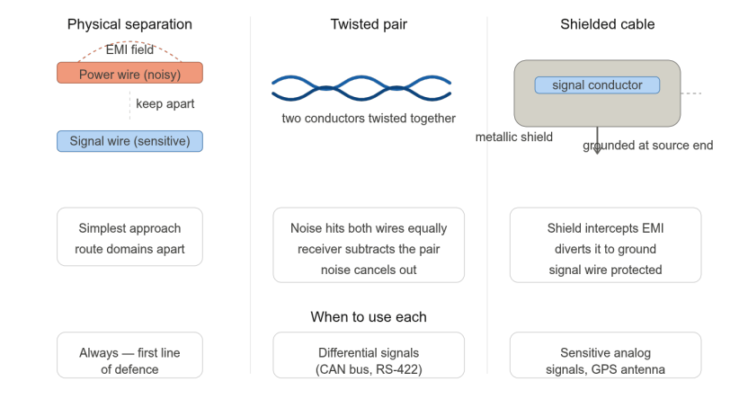
*Figure 5.9 — EMI separation and shielding strategies*

High-current wires — particularly those feeding motors and ESCs — generate electromagnetic interference (EMI). This noise radiates from the wire and can couple into adjacent signal lines, appearing as measurement errors in sensors or data corruption in communication buses. Three strategies are used to manage this at harness level.

**Physical separation** is the simplest and most effective first measure. Keeping power and signal harnesses apart — routing them on opposite sides of the airframe, for example — reduces the coupling field by distance alone. No additional components are needed. This should always be the first consideration.

**Twisted pairs** are used for differential signal lines — pairs of conductors where the signal is carried as the difference between two voltages rather than a single voltage referenced to ground. Twisting the pair ensures that any external noise field hits both conductors equally. Because the receiver measures the difference between them, the common-mode noise cancels out. CAN bus, RS-422, and similar protocols use twisted pairs for this reason.

**Shielded cables** surround one or more signal conductors with a metallic braid or foil. The shield intercepts radiated EMI and diverts it to ground before it reaches the inner conductor. The shield must be grounded — but at one end only. Grounding both ends creates a ground loop, which can actually introduce additional noise. For most UAV applications, the shield is grounded at the source end.

As a systems engineer, the decision about which mitigation to apply is made at architecture level:

- Physical separation applies everywhere, always
- Twisted pairs are specified for all differential communication buses
- Shielded cables are specified for sensitive analog signals and GNSS antenna feeds

### 5.5 Color Coding

Color coding is a maintainability and safety measure. It allows a technician to identify wire function at a glance, without tracing the wire or consulting the schematic. In aviation, color coding follows established standards — the most common reference for military and professional UAV applications is MIL-STD-1247.

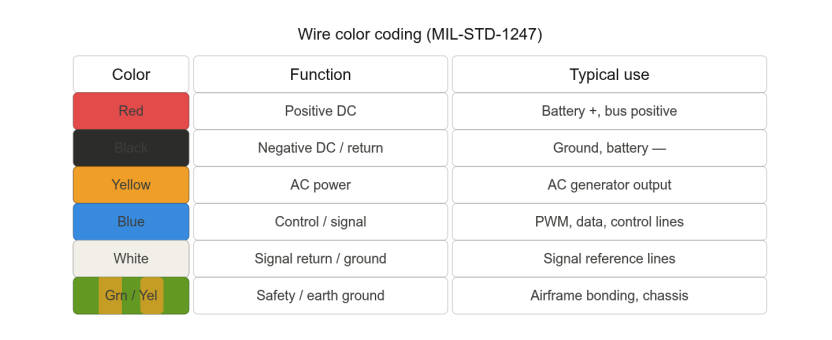
*Figure 5.10 — Wire color coding*

The standard is worth knowing, but the more important principle is **consistency**. In a custom UAV development, the specific colors chosen matter less than applying them consistently across the entire harness. A document — typically called a cable schedule or wire list — records every wire in the system with its gauge, color, length, source connector, and destination connector. Without this document, even a well-colored harness becomes difficult to maintain.

### 5.6 Harness as a Maintainability Issue

A wiring harness is not only an electrical component — it is also a maintainability artifact. A harness that is difficult to inspect, trace, or replace increases maintenance time, increases the risk of errors during reassembly, and reduces the overall system reliability.

Good harness design considers:

- **Access** — critical connectors and test points must be reachable without removing major components
- **Replaceability** — individual branches should be replaceable without disturbing the entire harness
- **Labeling** — wires and connectors should be labeled at both ends, not just at the source
- **Documentation** — a complete cable schedule must exist and must be kept updated when changes are made

In practice, a poorly documented harness is one of the most common reasons why a UAV becomes difficult to maintain after initial development. This is a systems engineering responsibility, not just a wiring technician's concern.

---

## 6. Connectors

A connector is the point where two parts of the electrical system meet mechanically and electrically. It allows subsystems to be assembled, tested, and replaced independently — which is one of the reasons connectors exist at all. Without them, every wire would be permanently joined, and replacing a single component would mean cutting and rejoining the entire harness.

Connectors are also one of the most failure-prone points in any electrical system. A poorly chosen or poorly assembled connector introduces resistance, generates heat, and can cause intermittent faults that are extremely difficult to diagnose in service.

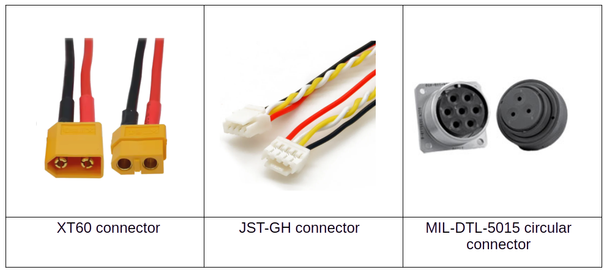
*Figure 5.11 — Examples of connectors.*

### 6.1 Selection Criteria

Before looking at specific connector types, it is useful to know what a systems engineer evaluates when selecting a connector for a given interface.

**Current rating** is the most fundamental criterion. The connector must handle the worst-case current on that circuit — not just the nominal value, but the peak transient. At high currents, contact resistance matters greatly: even a small resistance generates significant heat (recall $\dot{Q} = I^2 \cdot R$). A connector that is adequate at nominal current may overheat during a transient.

**Voltage rating** defines the maximum voltage the connector can safely handle without risk of arcing between contacts. In standard UAV applications operating at 14–25 V, most connectors exceed this requirement comfortably, so it is rarely a concern. However, as UAV systems move toward higher voltages — 48 V or above, which is becoming more common in heavy-lift platforms — the gap between contacts becomes critical. At higher voltages, electricity can jump across a small air gap between pins, causing a short circuit or fire. In these cases, voltage rating becomes a genuine selection criterion, not just a formality.

**Environmental rating** covers temperature range, moisture resistance, and vibration tolerance. A connector used inside a sealed, temperature-controlled electronics bay has different requirements from one mounted on an external frame exposed to rain, dust, and vibration.

**Keying** prevents incorrect mating — a safety feature that matters most where reversed polarity or wrong-connector errors would cause damage. XT connectors, for example, are physically asymmetric so positive and negative cannot be swapped.

**Mating cycles** — how many times the connector can be connected and disconnected before performance degrades. For a battery connector that is removed after every flight, this number accumulates quickly.

### 6.2 Common Connector Types in UAVs

Different interfaces in the EPS have very different current levels and environmental requirements. No single connector type suits all of them. The most common types in UAV practice are described below.

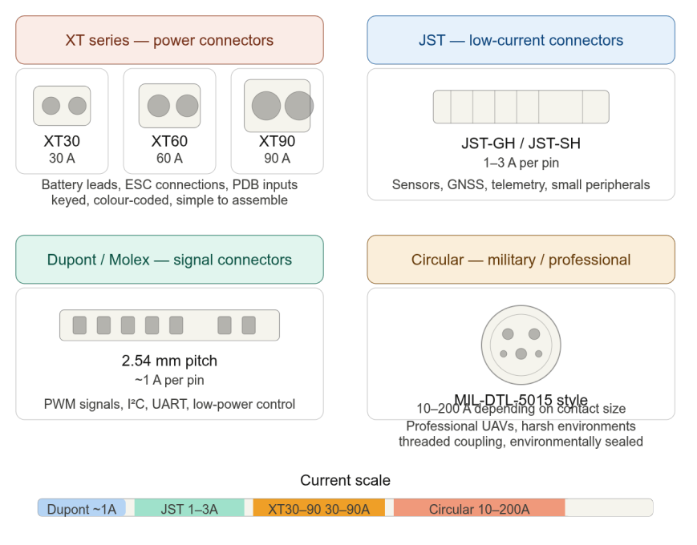
*Figure 5.12 — Common UAV connector types*

#### XT Series (XT30, XT60, XT90)

The XT series connectors — made by Amass and widely used in UAV and RC applications — are the standard choice for power connections in the high-current domain. They are rated at 30 A, 60 A, and 90 A respectively, and their gold-plated bullet contacts provide low resistance even at high currents.

They are keyed by physical asymmetry: the male and female housings can only mate one way, preventing polarity reversal. The plastic housing is durable and temperature-rated to handle heat from sustained high-current operation.

In UAV practice: XT60 is the most common choice for battery-to-PDB connections on small to medium UAVs. XT30 is used for lower-current branches (PDB to regulator inputs). XT90 is reserved for high-power systems drawing sustained currents above 60 A.

#### JST Connectors

JST (Japan Solderless Terminal) is a family of small, lightweight connectors designed for low-current signal and power connections. The variants most common in UAVs are JST-GH and JST-SH, which have 1.25 mm and 1.0 mm pin pitches respectively.

Current capacity is limited to approximately 1–3 A per pin, making them unsuitable for power circuits but well suited for sensors, GNSS receivers, telemetry modules, and other low-power peripherals. They are compact, lightweight, and polarized to prevent incorrect insertion.

#### Dupont / Molex Connectors

Dupont connectors (2.54 mm pitch) are the standard for signal-level connections between PCBs and peripherals. They are simple, inexpensive, and widely available. Most hobby-grade flight controllers use Dupont headers for PWM servo outputs, UART connections, and I²C buses.

Current capacity is approximately 1 A per pin. They are not polarized by default — incorrect mating is possible unless the installer is careful. For this reason, they are not appropriate for power connections, even at low voltages.

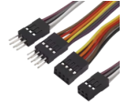  

 *Figure 5.13 — Dupont connector*

#### Circular Military-Style Connectors (MIL-DTL-5015)

Circular connectors following the MIL-DTL-5015 standard are the professional-grade choice for harsh-environment applications. They feature a threaded coupling that locks against vibration, an environmental seal that prevents moisture and dust ingress, and multiple contact arrangements in a single connector (power and signals combined).

Current ratings depend on contact size — from a few amperes for signal contacts up to 200 A for large power contacts. They are significantly more expensive and heavier than UAV-grade connectors, but appropriate for professional systems that require long-term reliability and certification.

### 6.3 Crimp vs. Solder

How the wire is attached to the connector contact is as important as the connector itself. A good connector with a bad termination is unreliable.

**Crimp connections** are made by inserting the wire into a terminal and compressing it with a dedicated crimp tool. When done correctly with the right tool, the result is a cold-weld between the wire strands and the terminal — a highly reliable, gas-tight joint. No heat is applied, so there is no risk of insulation damage. Crimp quality is consistent and repeatable, which is why crimping is the standard method for aircraft harnesses.

The critical requirement is the correct tool. A crimp made with pliers or the wrong tool does not achieve the required compression — it looks acceptable externally but fails under vibration or thermal cycling.

**Solder connections** are made by flowing molten solder over the wire and terminal. When done well, the joint is reliable and has very low resistance. Solder is appropriate for PCB connections and static assemblies where the joint will not be subject to repeated mechanical stress.

In a harness that moves or vibrates, solder joints are less suitable because solder is brittle — over time, it can crack at the point where the flexible wire meets the rigid joint. This is the origin of the common failure mode called "cold solder joint" — a crack that forms a high-resistance or intermittent connection.

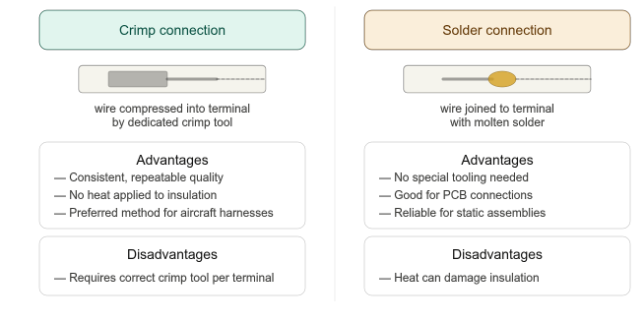  
*Figure 5.14 — Crimp vs. solder*

**In UAV harness practice:** crimp for all harness terminations, solder for PCB connections and connector housings where the joint will not flex.


### 6.4 Connector Interface Architecture

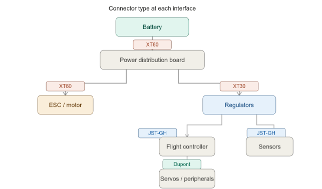

*Figure 5.15 — Connector interface map*

At system level, the connector type at each interface is determined by the current level and environmental requirements at that point in the power tree. The figure shows how connector types map to interfaces in a typical UAV EPS.

The pattern is consistent with the domain separation discussed in Section 3: high-current interfaces use high-rated connectors (XT60, XT90), medium interfaces use lighter connectors (XT30), and signal-level interfaces use the smallest and lightest types (JST-GH, Dupont). Choosing a connector that is oversized for its interface wastes weight. Choosing one that is undersized is a safety risk.

Defining connector types at each interface is part of the Interface Control Document (ICD) — the document that specifies exactly what is exchanged at every system boundary. Connector selection is not a wiring detail to be decided during assembly. It is an architecture decision made during system design.

---

## 7. Interfaces (System Integration Points)

Every boundary between two subsystems is an interface. Interfaces are where integration problems happen — a component that works correctly in isolation may still fail when connected to another if their interface assumptions do not match. For the EPS, which connects to almost every other subsystem, defining interfaces clearly is one of the most important tasks in system design.

There are two fundamentally different types of EPS interface, and keeping them distinct is essential.

### 7.1 Power Interfaces vs. Signal Interfaces

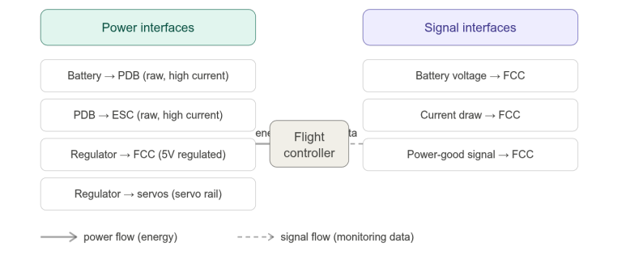
*Figure 5.12 — Power vs. signal interfaces*

**Power interfaces** carry electrical energy from one component to another. They are characterised by voltage, current, and the connector type at the boundary. Examples: battery to PDB, PDB to ESC, regulator to flight controller. The flow is always one direction — from source to load.

**Signal interfaces** carry information — monitoring data about the state of the power system. They do not deliver energy; they deliver numbers. Examples: battery voltage reading to flight controller, current draw measurement to telemetry, power-good signal to avionics. These are typically low-voltage, low-current digital connections.

The distinction matters because the two types have entirely different failure modes and design requirements. A fault on a power interface — an overcurrent, a voltage sag, a bad connection — directly affects the subsystem being powered. A fault on a signal interface — a missing reading, a corrupted data packet — affects the flight controller's awareness of the power state, but does not directly interrupt power delivery.

Mixing the two up in system documentation is a common source of confusion. A clear interface definition always states which type it is.

### 7.2 What Must Be Defined at Each Interface

For every interface in the EPS, the following must be specified:

- **Voltage range**: nominal voltage and the minimum/maximum the receiving subsystem can tolerate
- **Maximum current**: worst-case continuous and peak transient
- **Connector type**: physical connector, pin assignment, and keying
- **Signal type** (for signal interfaces): digital protocol, voltage levels, data rate

These four items constitute the minimum definition of an interface. If any one of them is left unspecified, there is a risk of incompatibility that will only be discovered during integration — the most expensive point to find and fix a problem.

### 7.3 EPS ↔ Flight Controller

The flight controller has a dual role in relation to the EPS: it is both a power consumer and a monitoring node.

**As a power consumer**, the flight controller receives regulated 5V from the avionics regulator. The interface requirements are tight: voltage must remain within ±5% under all load conditions, transient response must be fast enough to prevent a reset during a sudden load change, and the supply must be isolated from the servo and sensor rails to prevent noise coupling.

**As a monitoring node**, the flight controller receives power system data through a separate signal interface. This typically includes:

- Battery voltage — used to trigger low-battery warnings and failsafe return-to-home
- Total current draw — used for power consumption logging and anomaly detection
- Power-good signals — digital flags indicating whether each regulated rail is within tolerance

The flight controller does not command the EPS hardware based on this data. It observes, reacts, and reports — but the power hardware operates independently. This separation is deliberate: a flight controller that is struggling to maintain control should not be simultaneously managing power distribution.

### 7.4 EPS ↔ Ground Systems

The EPS also interfaces with systems outside the UAV boundary — ground-based equipment used during pre-flight preparation and post-flight maintenance.

**Battery charger**: connects to the battery through the same connector used for flight, or through a dedicated charging port. The charging interface must define maximum charge voltage, charge current, and the communication protocol used between the charger and the battery management system (if any). Using the wrong charger — one that does not respect these parameters — is a common cause of battery damage.

**Ground power supply**: some UAV platforms support connection to an external power supply during bench testing, allowing the avionics and sensors to be powered and tested without depleting the flight battery. The interface must be clearly specified to prevent accidental connection of the wrong voltage.

**Test equipment**: multimeters, current clamps, battery testers, and power analysers connect to the EPS at designated test points. Defining these points explicitly — rather than leaving technicians to probe wherever they can reach — reduces the risk of accidental short circuits and makes maintenance procedures repeatable.

These ground interfaces are often overlooked during system design and documented as an afterthought. In practice, poorly defined ground interfaces are a frequent cause of ground handling incidents.

### 7.5 Interface Control Document (ICD)

An Interface Control Document — commonly called an ICD — is the formal record of all interface definitions between subsystems. It is not a design document. It does not describe how each subsystem works internally. It describes only what is exchanged at each boundary.

For the EPS, a typical ICD would contain:

- A table of all power interfaces with voltage range, maximum current, and connector type
- A table of all signal interfaces with protocol, data format, and update rate
- A diagram showing all interfaces at system level (the power tree, annotated with interface IDs)
- Any constraints or assumptions that each interface partner must satisfy

The ICD serves two practical purposes. First, it prevents integration surprises — if two teams are developing different subsystems, the ICD is the agreement between them. Second, it provides a baseline for testing — every interface in the ICD is a test point, and integration testing verifies that each interface delivers what the ICD specifies.

In small UAV projects, a full ICD may feel like excessive documentation. But even a simple one-page table of interface definitions saves significant time during integration and troubleshooting.

### 7.6 Digital Communication Protocols — A Brief Overview

Signal interfaces in a UAV are not always simple analogue voltage readings. Modern avionics systems use digital communication protocols to exchange structured data between components. Three protocols are commonly encountered in UAV EPS interfaces.

**CAN bus** (Controller Area Network) is a two-wire network protocol originally developed for automotive use and widely adopted in UAV and aerospace applications. Multiple nodes — flight controller, power management module, ESCs, sensors — share the same two-wire bus. Each node can transmit and receive messages independently. CAN is well suited for distributing power system status data: battery voltage, bus health, current draw, and fault codes are all transmitted as structured messages that any node on the bus can read. It is robust against electrical noise, which makes it appropriate for the noisy environment near high-current wiring.

**UART** (Universal Asynchronous Receiver-Transmitter) is a simple point-to-point serial protocol connecting exactly two devices — one transmitter and one receiver. It is the most common protocol for connecting a flight controller to a peripheral: GNSS modules, telemetry radios, and companion computers typically use UART. In the EPS context, UART is used where a power management module or battery system communicates directly with the flight controller without needing a shared bus.

**I²C** (Inter-Integrated Circuit) is a two-wire bus protocol designed for short-range communication between a master device and multiple sensors. The flight controller acts as the master and polls each sensor in turn. IMUs, barometers, compasses, and some power monitoring chips communicate over I²C. Its limitation is distance — I²C is reliable only over short runs of a few centimetres to a few tens of centimetres, making it unsuitable for connections that span the airframe.

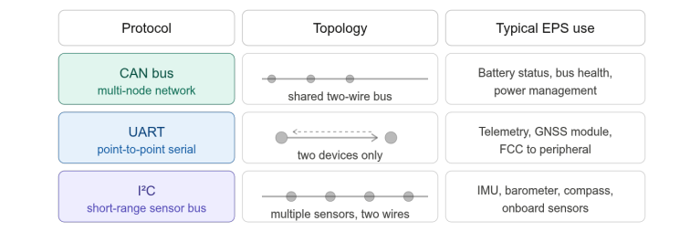
*Figure 5.17 — Digital protocols*

At system level, the protocol choice for each signal interface is part of the interface definition and must appear in the ICD. A signal interface defined only as "digital" without specifying the protocol is incomplete.

---

## 8. System Integration Summary

This section does not introduce new content. Its purpose is to bring together everything covered in Sections 1 through 7 and show how the pieces form a coherent system — and where that system is most vulnerable.

---

### 8.1 The Full EPS Picture

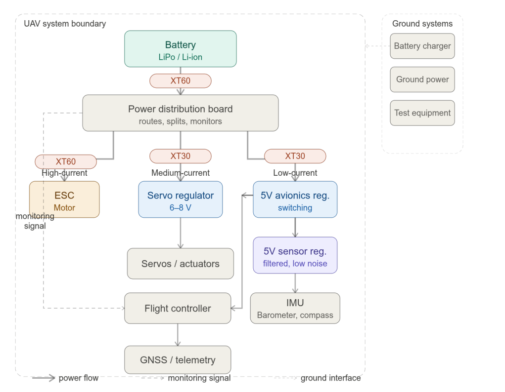
*Figure 5.14 — Full EPS block diagram*

Reading the block diagram from top to bottom traces the complete path of electrical energy through the system:

The **battery** is the sole energy source. It delivers raw, unregulated voltage that varies with state of charge, load, and temperature. Nothing downstream should depend directly on this raw voltage except the ESC.

The **power distribution board** accepts this raw voltage and splits it into branches. It does not regulate — it routes. It also measures voltage and current and passes this data to the flight controller as a monitoring signal.

Three **power domains** emerge from the PDB. The high-current domain feeds the ESC and motor directly — raw, noisy, high power. The medium-current domain passes through a servo regulator before reaching the servos. The low-current domain passes through two stages of regulation — a switching regulator for efficiency, followed by a filtered stage for noise-sensitive sensors — before reaching the flight controller, GNSS, IMU, and barometer.

The **monitoring signal** runs as a separate path from the PDB to the flight controller. It carries no power — only information. The flight controller uses it to observe battery state and trigger failsafes, but it does not control the power hardware.

**Ground systems** — charger, ground power supply, test equipment — sit outside the system boundary. They interact with the EPS through defined interfaces but are not part of the onboard system.

### 8.2 Key Design Principles

Seven principles run through this chapter. They are worth stating together.

**Raw battery voltage is never trusted directly.** Every sensitive subsystem is protected from battery variability by a regulator. This is not optional — it is the foundation of a reliable EPS architecture.

**Domain separation prevents cascading failures.** High-current, noisy loads are kept electrically separate from sensitive, low-current loads. A fault or transient in the propulsion domain must not be able to reach the avionics domain.

**Monitoring is not control.** The flight controller observes the power state — it does not command power hardware. This separation keeps the power system functional even when the avionics is struggling.

**Both wire sizing criteria must be satisfied.** Current capacity and voltage drop are independent requirements. A wire that passes one check but fails the other is incorrectly sized. Both must be verified for every circuit.

**Connector selection is an architecture decision.** The connector type at each interface reflects the current level, environmental conditions, and maintainability requirements at that point. It is not a wiring detail to be decided during assembly.

**Interfaces must be fully defined before integration.** Voltage range, maximum current, connector type, and signal protocol must all be specified for every interface. Incomplete interface definitions are the most common cause of integration problems.

**Failure modes must be addressed at design stage.** Brown-out, over-discharge, and connector failure are predictable. The architectural response to each — rail separation, voltage monitoring, correct termination practice — is decided during design, not discovered during troubleshooting.

### 8.3 Common Failure Paths

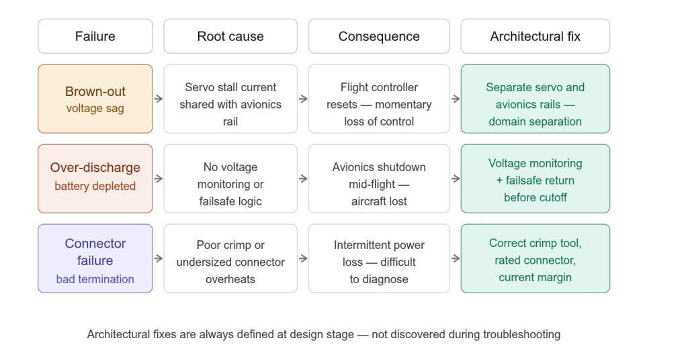
*Figure 5.19 — Common failure paths*

Three failure scenarios deserve particular attention because they are common, consequential, and entirely preventable through correct architecture.

**Brown-out** is the most frequently misdiagnosed EPS failure. It presents as erratic flight controller behaviour or an unexplained reset, and is often attributed to firmware or sensor problems. The actual cause is a shared power rail that collapses under a transient load — most commonly a servo stall. The fix is domain separation: servo and avionics rails must be independent, sized and regulated separately.

**Battery over-discharge** occurs when the battery is allowed to deplete below its minimum cell voltage, either because the mission ran too long or because no voltage monitoring was implemented. The consequence is an abrupt loss of power mid-flight. The fix is voltage monitoring at the PDB, with failsafe logic in the flight controller configured to initiate a return-to-home or landing before the battery reaches its cutoff threshold.

**Connector failure** is insidious because it typically presents as an intermittent fault rather than a clean failure. A connector that was assembled with the wrong crimp tool, or that is undersized for its current load, develops high contact resistance over time. The resistance generates heat, which accelerates degradation, which increases resistance further. Eventually the connection becomes unreliable. The fix is using the correct crimp tool for every termination, selecting connectors rated above the worst-case current, and inspecting connections during scheduled maintenance.

### 8.4 Bridge to Chapter 6

The EPS is the foundation that makes everything else possible. Chapter 6 turns to the Communication and Ground Control Station (GCS) systems — the subsystems responsible for exchanging data between the UAV and the operator on the ground.

The EPS connection is direct: communication hardware is one of the most power-sensitive loads in the system. Telemetry radios, data links, and GCS interfaces all depend on the clean, stable power rails defined in this chapter. A poorly designed avionics rail does not only threaten the flight controller — it threatens the communication link as well.
---